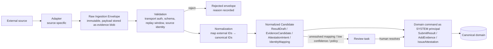

# BRT-02 — Ingestion, Adapters, Evidence Storage & Chain Adapters

| Field | Value |
|---|---|
| Ticket | BRT-02 |
| Status | Proposed — for review |
| ADRs | [0017 ingestion boundary](../adr/ADR-0017-external-ingestion-boundary.md), [0018 evidence object storage](../adr/ADR-0018-evidence-object-storage.md), [0019 blockchain adapter boundary](../adr/ADR-0019-blockchain-adapter-boundary.md) |

---

## 1. Inbound ingestion boundary

**Rule:** external systems **never write canonical tables**. That covers Sportradar-class data feeds, federation APIs, timing providers, scoreboards, club software, uploaded sheets, hardware devices and future AI officiating. Everything enters through the same pipeline, and every item ends as either:

- a normal domain command (submit result, add evidence, issue attestation) executed **as the source's SYSTEM principal**, subject to the same authority checks as a human; or
- a review task for a human.



### 1.1 Adapter contract (conceptual interface)

```
Adapter {
  adapterId, adapterVersion                       -- versioned & registered; version recorded on every envelope
  sourceKind                                      -- PROVIDER_FEED | FEDERATION_API | TIMING_SYSTEM | SCORING_SYSTEM | CLUB_SOFTWARE
                                                  -- | MANUAL_UPLOAD | DEVICE | AI_PIPELINE | OFFICIATING_SYSTEM
  sourcePrincipalId                               -- the SYSTEM (or ORGANIZATION) principal this adapter speaks for
  transport: PULL (poll/API) | PUSH (webhook) | UPLOAD | DEVICE_STREAM
  authenticate(request) → TransportAuthResult     -- HMAC over RAW body + timestamp window, mTLS, OAuth client, device signature
  receive(...) → RawIngestionEnvelope[]
  payloadSchemas: [schemaId@version]              -- source-native schemas the adapter understands
  normalize(envelope, mappingContext) → NormalizedCandidate[] | NormalizationError
  capabilitiesRequired: [SUBMIT_RESULT | ATTEST_RESULT | …]  -- checked against the source principal's grants
}
```

### 1.2 Raw Ingestion Envelope

```
RawIngestionEnvelope {
  envelopeId (UUIDv7)
  adapterId, adapterVersion
  sourcePrincipalId
  externalEventId            -- source's own id for this message (or derived: file hash for uploads)
  externalRefs[]             -- source ids for competition / contest / athlete / team mentioned
  sourceTimestamp            -- claimed by source
  receivedAt                 -- platform time
  transportAuth              -- method + result (e.g. HMAC_OK with key version), device signature status
  payloadBlobHash            -- sha256 of RAW bytes (stored as EvidenceItem type PROVIDER_FEED / TIMING_SYSTEM_EXPORT / …)
  payloadMediaType, payloadSchema (schemaId@version)
  idempotencyKey = H("ingestion-key", sourcePrincipalId ‖ externalEventId ‖ payloadBlobHash)
  status: RECEIVED → VALIDATED → NORMALIZED → COMMITTED | REJECTED | NEEDS_REVIEW
}
```

**The raw payload is always preserved as Evidence.** It becomes an EvidenceItem, and whatever the normalization produced is linked to it via `derivedFrom` / evidence links. Any canonical result from a feed can therefore be traced back to the exact bytes received.

### 1.3 Validation rules

- **Webhooks.** HMAC over the **raw body bytes** (not re-serialized JSON; see BRT-00 M-8), plus a timestamp header within ±5 minutes, plus nonce/`externalEventId` uniqueness. The secret is taken from the secret manager and is versioned.
- **Devices and certified systems.** A device signature is verified against the DeviceRegistration key. The `configHash` is extracted and recorded.
- **Uploads** (scoresheets, CSVs). They are authenticated to the uploading account's principal, and the file hash becomes the `externalEventId`.
- **Checks common to every source:** source principal status is ACTIVE; the adapter version is allowed; the payload schema is known.
- **Replay.** A duplicate `idempotencyKey` is dropped, and the existing envelope is returned. A different payload under the same `externalEventId` is treated as a **source-side correction candidate**, never an overwrite.

### 1.4 Normalization and identity mapping

- **ExternalIdentifier mapping.** Source ids map to canonical ids through `ExternalIdentifier(namespace = sourcePrincipal/registry, value)` ([Identity §2](./BRT-02-IDENTITY-AND-AUTHORITY.md#2-identity-entities)). An **unresolved or ambiguous mapping never auto-creates** athletes or competitions without policy. It creates a review task, or a *provisional* unclaimed Athlete when the source is authoritative for that namespace (e.g. a federation roster).
- **Unit and metric conversion** uses DisciplineVersion metrics. The source's raw values are preserved in the evidence.
- **Candidate types:**

| Candidate | Becomes |
|---|---|
| `ResultDraftCandidate` | `SubmitResult` (T1/T2) by the source principal. Whether it auto-advances to PROVISIONAL depends on the event's auto-accept policy for that source. |
| `EvidenceCandidate` | `AddEvidence` with subject links |
| `AttestationIntent` | `IssueAttestation`. For device-signed sources, the device signature itself is the envelope (`COSE_SIGN1`/`DEVICE_RAW`). For API feeds without per-message signatures, the provider's service key (`JWS_DETACHED`) signs the statement *in the provider's own infrastructure*. **The platform never signs as the provider.** |
| `CorrectionCandidate` | Changed data for an already-submitted result. It goes to the result authority as a proposed correction (BRT-01 disputes §2), never as a silent update. |

### 1.5 Source-specific notes

| Source | Notes |
|---|---|
| Commercial sports data feeds | PULL or PUSH; evidence = `PROVIDER_FEED`; the provider holds a grant (e.g. `ATTEST_RESULT` for leagues it covers); licensing restricts evidence visibility (PLATFORM_PRIVATE) |
| Federation APIs | Federation SYSTEM principal under its anchor; often authoritative for rosters (ExternalIdentifier issuer) and sanctions |
| Timing providers / scoreboards / scoring hardware | DEVICE_STREAM or batch export; device-signed where possible; `capturedAtAssurance = DEVICE_SIGNED` |
| Club software | CLUB_SOFTWARE adapter with the club's SYSTEM principal; typically V1/V2 contributions |
| Manual organizers / uploaded sheets | MANUAL_UPLOAD: `SIGNED_SCORESHEET` / `DOCUMENT` evidence plus a human draft; optional OCR produces **`AI_DERIVED`** evidence with `derivedFrom` = the upload (E-4) |
| Certified machine officiating | OFFICIATING_SYSTEM adapter: raw media plus decisions (`OFFICIATING_SYSTEM_OUTPUT`) with `configHash` ([Identity §7](./BRT-02-IDENTITY-AND-AUTHORITY.md#7-system-principals-devices-and-certified-machines)) |
| Generic AI pipelines | AI_PIPELINE adapter; outputs are always typed `AI_DERIVED` |

---

## 2. Evidence storage

([ADR-0018](../adr/ADR-0018-evidence-object-storage.md))

### 2.1 Model

```
evidence_blob (content-addressed, sha256 of raw bytes)
   ↑ 1..n
evidence_item (who/what/when/why: source, capture, privacy class, retention)
   ├─ evidence_subject_link → result version / contest / performance / incident / participant entry
   ├─ evidence_provenance_edge → derived_from other evidence items (+ transformation, tool, version)
   ├─ evidence_custody_event (append-only)
   └─ evidence_assessment (append-only findings)
```

- **One blob, many items.** The same bytes submitted by two sources are **one blob** but **two evidence items**, because provenance differs.
- **Derived evidence** (thumbnails, transcodes, redacted versions, clips, OCR/CV extractions) is always a **new** evidence item with a provenance edge. The platform never modifies the original.

### 2.2 Storage options evaluated

| Option | Verdict |
|---|---|
| **Private S3-compatible object storage, content-addressed keys** | **Recommended.** Keys are `blobs/sha256/<ab>/<cd>/<hash>`, with server-side encryption (KMS) and a per-class key hierarchy. Versioning is on and object lock (WORM) applies for retention-bound classes. Lifecycle rules implement retention. |
| IPFS (public) | **Not for private evidence.** Anything pinned to a public network is effectively public forever, which contradicts BRT-01 E-6 and ADR-0009. Acceptable **only** for PUBLIC-released evidence and trophy metadata, as a secondary replica. |
| Content-addressed storage in general | Adopted as the *addressing scheme*. The hash is the identity regardless of backend. `storage_refs` can list several replicas (object store, IPFS for public items, cold archive). |
| Database BLOBs | Rejected for size and backup reasons. |

### 2.3 Privacy, access and retention

| Privacy class (BRT-01) | Storage | Access path |
|---|---|---|
| PUBLIC (released by the rights holder) | Private bucket plus an optional public CDN/IPFS replica | Public URL |
| PLATFORM_PRIVATE | Private bucket, SSE-KMS | Short-lived signed URL issued by the Evidence module after an app-authz check; access logged |
| AUTHORITY_ONLY | Private bucket, **client-side envelope encryption** with a class-specific KMS key | Signed URL plus decryption only for principals with a grant covering the purpose; every access is audited with the grant id |

- **Minors' media** default to AUTHORITY_ONLY until guardian consent is recorded.
- **Retention.** Each EvidenceItem has a `retention_policy_id`, for example "operational evidence: competition end + N years", "record-supporting evidence: indefinite", or "raw video: short unless it supports a dispute or record". Retention and deletion change **availability only** (§2.5): the item row, its content hash, its assessments, the attestations citing it, and past verifications are never deleted. Record-supporting and disputed evidence is placed under a legal/retention hold. Concrete periods are not chosen here.

### 2.4 Evidence availability model

Availability is an **append-only status** (`evidence_availability_change`, stream `EVIDENCE_ITEM`) with a projection `evidence_item_state.availability`. `legal_hold` is an orthogonal flag, set and released by appended entries.

| Availability | Bytes exist? | Inspectable by authorized parties? | Meaning |
|---|---|---|---|
| `AVAILABLE` | Yes | Yes (per privacy class) | Normal |
| `ARCHIVED` | Yes (cold storage) | Yes, with retrieval delay | Moved to archive tier |
| `RESTRICTED` | Yes | **No**, pending a decision (e.g. an erasure request under review, a legal restriction, a rights-holder objection) | Access blocked; bytes preserved |
| `EXPIRED` | Yes, scheduled for deletion | Yes, until deletion | Retention elapsed; deletion pending (blocked if `legal_hold`) |
| `DELETED_BY_RETENTION` | **No** | **No** | Bytes removed by the retention policy |
| `DELETED_BY_ERASURE` | **No** | **No** | Bytes removed by a legal erasure order (may override a retention hold where the law requires; recorded with the legal basis reference) |

**What deletion never erases:**

- that the evidence was ingested;
- its content hash, metadata, provenance and custody history;
- the assessments made about it;
- the attestations that cited it;
- the **historical verification assessments** computed while it was available. These remain immutable records of what was decided at that time and on what inputs (`inputsDigest`).

**What deletion does change:**

- **A hash alone does not permit independent re-inspection.** A new verifier can confirm that attestations referenced a given hash, but can no longer check the bytes themselves.
- **Verification inputs include availability.** Whenever availability changes, a re-verification is triggered, because it changes the `inputsDigest`.
- **Honest flagging.** The new assessment carries flag `EVIDENCE_UNAVAILABLE` (listing the affected items). **Deleted evidence is never represented as inspectable.**
- **Level impact is a policy decision.** The verification policy defines, per level and per evidence role, whether current availability is required:
  - the evidence may still count on the basis of its ingestion-time integrity check and existing attestations, with the flag; or
  - the level is withheld until replacement evidence is supplied.

  The recommended default is proposed for BRT-03, not decided here. Record-grade (V4) policies will typically require `AVAILABLE` or `ARCHIVED`, which is why record-supporting evidence is held.

### 2.5 Large objects and streams

- **Multipart uploads** go directly from the client to the object store using pre-signed URLs, with a declared hash that is verified server-side after upload by streaming SHA-256. The EvidenceItem is committed only after verification.
- **Video and sensor streams** are chunked, with a **manifest** listing chunk hashes. The manifest is itself an evidence blob and is device-signed for certified systems. The manifest hash is the stream's identity.
- **Integrity sweeps.** Scheduled jobs re-hash a sample of stored blobs, and a mismatch produces an `INTEGRITY_FAILED` assessment.

---

## 3. Outbound adapters: blockchains

([ADR-0019](../adr/ADR-0019-blockchain-adapter-boundary.md))

### 3.1 Ports (domain-facing, chain-agnostic)

| Port | Operations | Domain inputs |
|---|---|---|
| `AnchoringPort` | `submitRoot(root, batchId)`, `status(ref)`, `verifyInclusion(root, ref)` | AnchorBatch root (bytes32) only |
| `CredentialPort` | `issue(credentialId, classId, recipientRef, metadataURI, commitment)`, `revoke(credentialId)`, `status(credentialId)` | Achievement-derived ids and commitments; recipient = wallet (opt-in) or salted commitment |
| `SettlementPort` (future) | `fundEscrow(termsHash, amount, asset)`, `release(payoutInstruction)`, `refund(...)`, `status(...)` | PrizeTerms hash, payout instruction (deterministic id), policy authorization |
| `AuthorityCommitmentPort` (future) | `publishRoot(registryRoot)` | Merkle root of active grants and keys, so contracts can verify authority proofs |

### 3.2 Adapter responsibilities

- **Network binding.** Map port calls to one network family: `evm-generic` (config per chain, e.g. Base, XRPL EVM), `xrpl-native`, others.
- **Signing.** Sign with the designated key (KMS signer or multisig proposer). **Never hold domain logic.**
- **Chain references.** Persist `external_chain_ref_event` rows (network CAIP-2, tx hash, log index, contract CAIP-10, token id, status, confirmations).
- **Confirmation and reorgs.** Track confirmation and finality, and handle **reorgs**: status goes REORGED, then resubmit. Idempotency comes from deterministic ids (credential id, instruction hash), so a resubmission cannot double-issue.
- **Fees and failures.** Surface them as statuses. Domain state stays correct whether or not the chain step has happened.

**The domain never waits on a chain for sporting truth.** Chains provide anchoring, representation and value custody only.

---

## 4. Outbound adapters: other

| Port | Purpose |
|---|---|
| `NotificationPort` | Email, push, SMS (provider adapters); templated; no PII in logs |
| `PaymentRailPort` | Fiat PSP (entry fees in; prize payouts out, later). Webhooks enter through the §1 ingestion boundary with raw-body verification and event-id idempotency (fixes BRT-00 M-1). |
| `IdentityProviderPort` | OIDC / email / passkeys (Accounts only) |
| `TimestampAuthorityPort` (optional) | RFC 3161 tokens for high-value statements |
