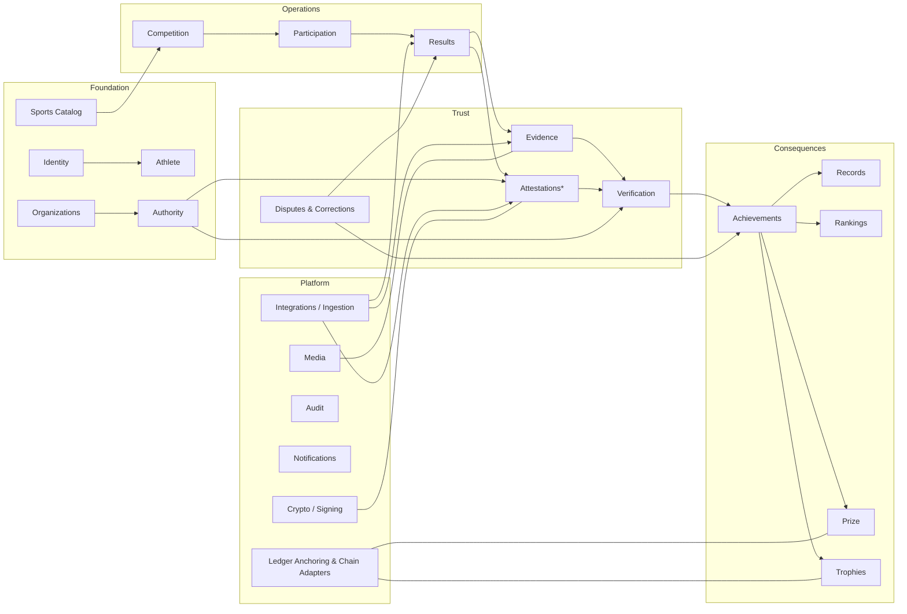

# BRT-02 — System Architecture

| Field | Value |
|---|---|
| Ticket | BRT-02 |
| Status | Proposed — for review |
| Starting contract | BRT-01 domain: [Result domain](../domain/BRT-01-RESULT-DOMAIN.md), [Verification model](../domain/BRT-01-VERIFICATION-MODEL.md), [Disputes & corrections](../domain/BRT-01-DISPUTES-AND-CORRECTIONS.md), [Data boundaries](./BRT-01-DATA-BOUNDARIES.md), ADR-0001…0009 |
| Companion docs | [Persistence](./BRT-02-PERSISTENCE-ARCHITECTURE.md) · [Identity & authority](./BRT-02-IDENTITY-AND-AUTHORITY.md) · [Signatures & hashing](./BRT-02-SIGNATURES-AND-HASHING.md) · [Verification engine](./BRT-02-VERIFICATION-ENGINE.md) · [Ingestion & adapters](./BRT-02-INGESTION-AND-ADAPTERS.md) · [Threat model](../security/BRT-02-THREAT-MODEL.md) · [Data access model](../security/BRT-02-DATA-ACCESS-MODEL.md) · [API surface](../api/BRT-02-API-SURFACE.md) · [Implementation stack](./BRT-02-IMPLEMENTATION-STACK.md) |
| ADRs | ADR-0010 … ADR-0020, listed in [§13](#13-adrs-introduced-by-brt-02) |

This document defines the *technical* architecture that implements the BRT-01 domain. It does not change that domain. Where BRT-02 had to interpret BRT-01, the interpretation is recorded in §10.

---

## 1. Architectural principles

These are carried from the BRT-02 brief and BRT-01. Each maps to a concrete mechanism in the architecture:

| Principle | Mechanism |
|---|---|
| **Append-only truth history** | Trust and consequence **ledger tables** are insert-only: no UPDATE or DELETE grants, plus triggers that reject mutation. Current state lives in separate **projection tables**, updated only in the same transaction as the ledger fact, and rebuildable. Caches are disposable. Not every table is insert-only ([Persistence §3.0](./BRT-02-PERSISTENCE-ARCHITECTURE.md#30-three-kinds-of-table-normative)). Batched Merkle anchoring makes tampering detectable ([Persistence §3](./BRT-02-PERSISTENCE-ARCHITECTURE.md#3-mutability-classification)). |
| **Layers never collapse** | Result, Evidence, Attestation, Verification, Achievement and consequences are separate modules with separate tables. A module can write only its own tables; cross-module effects flow through commands and domain events. |
| **Chain-agnostic domain** | Blockchains sit behind ports (Anchoring, Credential, Settlement, AuthorityCommitment), implemented by adapters ([ADR-0019](../adr/ADR-0019-blockchain-adapter-boundary.md)). Domain ids are UUIDv7, never chain ids. |
| **No PII on-chain** | Only digests, commitments and domain ids cross the chain adapter. PII lives in a separate personal-data store ([Data access model](../security/BRT-02-DATA-ACCESS-MODEL.md)). |
| **Non-custodial** | No user private keys or mnemonics are stored anywhere. Platform keys live in cloud KMS. Wallet control is proven by signature ([ADR-0016](../adr/ADR-0016-key-management.md)). |
| **Explicit authorization** | Domain actions are authorized by the Authority Engine (grant chain, scope, capability, time, conflict). Dashboard RBAC is a UI convenience only ([ADR-0020](../adr/ADR-0020-three-layer-authorization.md)). |
| **Operational simplicity** | A modular monolith on PostgreSQL, with a transactional outbox and a Postgres-backed job queue. No broker or microservices until justified ([ADR-0010](../adr/ADR-0010-modular-monolith.md), [ADR-0012](../adr/ADR-0012-transactional-outbox.md)). |

---

## 2. System context

```mermaid
flowchart TB
    subgraph People["Human actors"]
      ATH[Athlete / Guardian]
      TEAM[Team captain]
      ORG[Organizer / Club staff]
      LEAGUE[League / Federation staff]
      OFF[Official / Referee / Judge]
      SPON[Sponsor]
      VEN[Venue operator]
      OPS[Platform operator]
      PUB[Public user]
      DEV[Developer / API consumer]
    end

    subgraph Machines["Machine actors (SYSTEM principals)"]
      DP[Sports data provider]
      TP[Timing provider / timing system]
      SS[Scoring system / hardware]
      CMS[Certified machine system<br/>line-call, officiating, certified camera]
      AIP[Generic AI pipeline<br/>AI_DERIVED only]
    end

    BR[["Bragging Rights Platform<br/>(modular monolith + worker)"]]

    subgraph External["External systems"]
      IDP[Identity providers<br/>email, OIDC/Google, passkeys]
      WAL[Wallets<br/>external, embedded, smart accounts]
      NOTIF[Email / notifications]
      PAY[Payment rails<br/>card/fiat PSP, stablecoin]
      CHAIN[Blockchain networks<br/>via adapters, none chosen]
      OBJ[Object storage<br/>private evidence]
      KMS[Cloud KMS / HSM]
      SAPI[Sports APIs<br/>e.g. commercial data feeds]
      FAPI[Federation APIs]
      VID[Video systems]
      AIO[Future AI officiating systems]
    end

    ATH & TEAM & ORG & LEAGUE & OFF & SPON & VEN & OPS -->|web app / API| BR
    PUB -->|public read| BR
    DEV -->|public + authorized API| BR
    DP & TP & SS & CMS & AIP -->|ingestion adapters, signed payloads| BR
    BR --> IDP
    BR <-->|proof-of-control, signatures| WAL
    BR --> NOTIF
    BR <--> PAY
    BR <-->|anchoring, credentials, settlement| CHAIN
    BR <--> OBJ
    BR -->|sign / verify, keys never leave| KMS
    SAPI & FAPI & VID & AIO -->|adapters| BR
```



### 2.1 Actors → principals

| Actor | Platform representation (see [Identity & authority](./BRT-02-IDENTITY-AND-AUTHORITY.md)) |
|---|---|
| Athlete | Person + Athlete + Account(s); a PERSON principal only when the athlete signs attestations (participant or opponent) |
| Guardian | Person + Account; a GuardianLink to a minor Athlete |
| Team | Team (identity); not a principal. Captains act through their own principal. |
| Organizer, Club, League, Federation, Venue | Organization + ORGANIZATION principal; staff are Accounts with Memberships, and any domain authority comes only through AuthorityGrants |
| Official / Referee / Judge | Person + PERSON principal + AuthorityGrants |
| Sponsor | Organization (principal only if it signs prize terms) |
| Sports data / timing / scoring provider | Organization principal + SYSTEM principals for feeds and devices |
| Certified machine system | SYSTEM principal with a DeviceRegistration, configuration and approval attestation |
| Generic AI pipeline | SYSTEM principal with source kind `AI_PIPELINE`; its outputs are `AI_DERIVED` evidence |
| Platform operator | Account with operator RBAC; the PLATFORM principal acts only through KMS-held keys under governance procedures |
| Public user | Anonymous; public read API only |
| Developer | API client credentials (public tier) or an organization-scoped client |

---

## 3. Bounded contexts

### 3.1 Context map



\*Attestations are a module *inside the Trust group*, owned together with signature verification.

### 3.2 Context responsibilities and boundary decisions

| Context | Owns (writes) | Key rule | Separate deployable? |
|---|---|---|---|
| **Identity** | Account, AuthenticationIdentity, WalletLink, Person (PII vault, via Data Access model), GuardianLink | Person ≠ wallet ≠ account | No, but the **PII vault** is a separate schema with separate DB roles |
| **Athlete** | Athlete, ExternalIdentifier (athlete), public profile settings | An Athlete references a Person; no PII in athlete tables | No |
| **Organizations** | Organization, OrganizationMembership, verification status (KYB) | Membership ≠ authority | No |
| **Authority** | Principal, PrincipalKey, DeviceRegistration, SystemConfiguration, TrustAnchor, AuthorityGrant (+ status ledgers) | Only the Authority context answers "was X authorized?" | No (a pure library plus tables) |
| **Sports Catalog** | Sport, Discipline, DisciplineVersion, Metric, FormatTemplate, JSON schemas, rule parameters, VerificationPolicy versions, AchievementRule versions | Published versions are immutable and content-hashed | No |
| **Competition** | Competition, Event, Round, Contest, Contestant, governance profile, protest-window configuration, advancement application | Advancement consumes PROVISIONAL results (ADR-0008) | No |
| **Participation** | Participant (entries), Team, TeamMembership (temporal), Lineup drafts, entry attributes, registration linkage | Frozen at event/contest start; amendments are versioned | No |
| **Results** | Result, ResultVersion, status transitions, classifications (derived results) | Content immutable after SUBMITTED | No |
| **Evidence** | EvidenceItem, EvidenceAssessment, blob registry, provenance edges | Blobs in private object storage, addressed by content hash | No; blob **access** goes through signed URLs |
| **Attestations** | Attestation, AttestationStatusChange, nonce registry | Signature verified and authority evaluated before acceptance | No |
| **Verification** | Verification assessments, dependency index | Computed only by the engine; never written by a user | No (a worker job) |
| **Disputes & Corrections** | Dispute (+ status), Correction, holds | Acts only through Result, Attestation and Evidence commands | No |
| **Achievements** | Achievement (+ status ledger) | Derived by rules; idempotent | No |
| **Records** | RecordCategory, RecordMark (+ status ledger) | Naming rule enforced by authority scope | No |
| **Rankings** | RankingSystem, RankingSnapshot (immutable), as-published and as-corrected views | Snapshots never rewritten | No; recomputation is a batch job |
| **Prize** | PrizeTerms, PrizeEntitlement (+ status), PayoutInstruction | Eligibility per the permission matrix; execution is policy-driven | **Candidate for later isolation** (value-bearing trust boundary) |
| **Trophies** | TrophyClass, TrophyIssuance (+ status), metadata | Minted only from an Achievement | No |
| **Media** | Media derivatives (thumbnails, transcodes, redactions) as derived evidence | Derived media are new EvidenceItems with `derivedFrom` | Transcoding may run as a separate worker pool later |
| **Integrations** | Adapter registry, RawIngestionEnvelope, NormalizedCandidate, ExternalId mappings | Never writes canonical tables directly | Adapters run in the worker; high-volume feeds could be isolated later |
| **Audit** | AuditEvent | Telemetry of actions, not sporting truth | No (append-only table; export to external sink later) |
| **Notifications** | Outgoing messages, preferences | Consumes domain events | No |
| **Crypto / Signing** | Canonicalization, hashing, signature verification, KMS signing gateway | The only code path that calls KMS sign | **Logical isolation now** (separate module and IAM principal); a separate process later |
| **Ledger Anchoring & Chain Adapters** | AnchorBatch, ExternalChainRef, adapter state | The only path to blockchains | Worker process; separate IAM |

---

## 4. Architecture style: modular monolith (+ worker), with isolated key boundaries

**Decision** ([ADR-0010](../adr/ADR-0010-modular-monolith.md)): the first implementation is a **modular monolith**. That is one codebase and one primary database, deployed as:

| Process | Role |
|---|---|
| `api` | HTTP API (public, authenticated, organizer, authority and internal endpoints). Stateless. Horizontally scalable. |
| `worker` | Outbox dispatcher, job queue consumers: verification recomputation, achievement derivation, ranking batches, ingestion adapters, anchoring, notifications, media derivatives |
| `web` | User-facing web application (dashboards, passport, public pages), calling `api` only. **It never talks to the database directly.** |

**Why not distributed services now:**

- **Team and scale.** The team is small and early volumes are small (club and national events).
- **Transactions.** The trust chain needs **transactional consistency** across Result, Attestation and status transitions, and the outbox needs to be in the same transaction. Distributing these would add sagas and failure modes without benefit.
- **The legacy lesson.** BRT-00 showed that fragmentation (27 overlapping SQL scripts, duplicate repositories) was a primary failure mode.

**Where separation *is* justified now (logical and IAM, not network):**

1. **Key usage.** Only the Crypto/Signing module holds IAM permission to call `kms:Sign`, and only for specific key aliases. The API process role cannot sign as the platform witness except through a narrow internal interface that requires an authenticated session context. This is a trust boundary.
2. **PII vault.** It is a separate Postgres schema and DB role. Most modules cannot read it at all.
3. **Chain adapters.** Only the worker's anchoring and settlement jobs hold chain credentials.

**Evolution triggers** (when to extract a service):

- The Prize settlement executor moves value above a threshold. Extract it to a separate service with its own keys and approvals.
- Ingestion throughput (sensor streams or video) needs independent scaling.
- An external party (a federation) needs to run a verifier. The verification engine is designed as a pure library, so this is packaging rather than redesign.

Module boundaries are enforced in code: each module exposes a public interface, and cross-module table access is prohibited by lint rules and per-module DB schemas.

---

## 5. Request and processing flows

### 5.1 Command path (synchronous)

```mermaid
sequenceDiagram
    participant C as Client (web / API / adapter)
    participant API as api process
    participant AZ as App authz (RBAC, session)
    participant AE as Authority Engine
    participant MOD as Domain module
    participant DB as PostgreSQL
    C->>API: command (idempotency key, payload / signed envelope)
    API->>AZ: authenticate + coarse permission (can this account use this endpoint?)
    API->>MOD: command
    MOD->>AE: authorized(principal, capability, scope, time)?
    AE->>DB: grant chain, keys, participation (conflict check)
    AE-->>MOD: decision + authorization proof
    MOD->>DB: BEGIN; insert ledger rows; update materialized current state; insert outbox events; insert audit event; COMMIT
    API-->>C: 201 / 200 (resource + contentHash)
```

### 5.2 Event path (asynchronous)

```
outbox row ──► dispatcher (worker) ──► job queue (Postgres-backed)
    ├─► Verification engine: recompute dependents ──► new Verification rows ──► VerificationChanged
    ├─► Achievement engine: derive / supersede / suspend
    ├─► Records / Rankings / Prize eligibility / Trophy issuance jobs
    ├─► Anchoring: add digests to the next AnchorBatch
    └─► Notifications
```

All consumers are idempotent ([Persistence §7](./BRT-02-PERSISTENCE-ARCHITECTURE.md#7-idempotency-model)).

---

## 6. Trust chain mapped to components

| Trust-chain step | Component | Persistence | Event |
|---|---|---|---|
| Sporting event | Competition / Participation | mutable operational tables | `ContestStarted`, `ContestCompleted` |
| Result | Results | `result_version` (immutable, content-hashed) + `result_status_transition` | `ResultSubmitted`, `ResultProvisional`, `ResultDeclaredOfficial`, `ResultFinalized`, `ResultSuperseded`, `ResultRevoked` |
| Evidence | Evidence + object storage | `evidence_item`, `evidence_blob`, `evidence_assessment` | `EvidenceAdded`, `EvidenceAssessed` |
| Attestation | Attestations + Crypto + Authority | `attestation`, `attestation_status_change`, `authorization_proof` | `AttestationIssued`, `AttestationRevoked`, `AttestationSuspect` |
| Verification | Verification engine | `verification`, `verification_dependency` | `VerificationChanged` |
| Verified achievement | Achievements | `achievement`, `achievement_status_change` | `AchievementRecognized`, `AchievementSuperseded`, `AchievementRevoked`, `AchievementSuspended` |
| Consequences | Records, Rankings, Prize, Trophies | respective ledgers | `RecordRatified`, `RankingSnapshotPublished`, `PrizeEntitlementCreated`, `TrophyIssued` |

---

## 7. Non-functional targets (initial)

| Concern | Target / approach |
|---|---|
| Availability | Single region, managed Postgres with PITR; RPO ≤ 5 min, RTO ≤ 4 h initially |
| Integrity | Ledger tables are append-only (grants + triggers); hash-chained per aggregate stream (no global chain); stream heads and unchained rows Merkle-anchored externally on a schedule (e.g. hourly and on-demand) |
| Latency | Command p95 < 500 ms excluding KMS; verification recompute eventual (seconds) |
| Scale | 10⁴–10⁶ result versions per year initially; sensor and video evidence as blobs only |
| Observability | OpenTelemetry traces and metrics; audit log separate from telemetry |
| Privacy | PII vault; field-level encryption for AUTHORITY-ONLY data; access logging on sensitive reads |

---

## 8. Blockchain boundary (summary)

See [ADR-0019](../adr/ADR-0019-blockchain-adapter-boundary.md) for the full decision.

```
Domain modules ──► Ports: AnchoringPort | CredentialPort | SettlementPort | AuthorityCommitmentPort
                         │
                         ▼
                 Chain adapters (one per network family): evm-generic (Base, XRPL EVM, …), xrpl-native, …
                         │
                         ▼
                 Networks
```

**What may go on-chain, and what must stay off:**

- **MAY go on-chain eventually:**
  - Merkle anchors of trust-layer digests;
  - trophy credentials (ids and commitments only);
  - prize escrow and settlement state;
  - authority-registry commitments (roots of grant/key state).
- **MUST stay off-chain:**
  - PII and evidence bytes;
  - result content (only hashes are anchored);
  - authority evaluation logic, verification policies and dispute content;
  - identity links.

**No chain is chosen**, because no requirement forces one yet. The first trigger for a choice is the first on-chain trophy issuance or prize escrow. Anchoring alone can begin on any low-cost network, or even on a non-chain transparency log, via the same port.

---

## 9. Machine / AI officiating readiness (summary)

The SYSTEM principal model supports these without new concepts ([Identity & authority §7](./BRT-02-IDENTITY-AND-AUTHORITY.md#7-system-principals-devices-and-certified-machines)):

- DeviceRegistration (device identity, device key, hardware attestation);
- SystemConfiguration (software, firmware and model versions, parameters; `configHash`);
- approval and calibration as `CONDITIONS_COMPLIANT` attestations over the `configHash`;
- scoped AuthorityGrants;
- raw evidence plus derived decisions (`OFFICIATING_SYSTEM_OUTPUT`) with provenance edges.

Generic `AI_DERIVED` evidence stays distinguishable by its source kind and provenance (verification model §2.6).

---

## 10. Interpretations of BRT-01 (no contradictions requiring a stop)

A full read of BRT-00 and BRT-01 found **no contradiction that requires changing the accepted domain model**. The following are implementation interpretations and are recorded for transparency:

| # | BRT-01 statement | BRT-02 interpretation |
|---|---|---|
| I-1 | ResultVersion carries `status` and `statusHistory[]` | Stored as a separate append-only `result_status_transition` ledger plus a materialized current status. The version's *content* row is never updated. |
| I-2 | EvidenceItem carries `assessments[]`; Attestation carries `statusHistory[]` | Separate append-only ledgers joined at read time |
| I-3 | RecordMark `effectiveTo` "set when superseded"; RC-3 restoration | `effectiveTo` is a **materialized** value derived from the RecordMark status ledger. It is never a primary mutable field. |
| I-4 | A-4: authority is evaluated "at issuedAt" (platform-observed) | Authority **and key validity** are evaluated at T = `issuedAt` (platform-observed). `signedAt` is a signer assertion used only for consistency checks, except the narrowly defined approved-offline-device rule. Grants cannot be retroactive. Replay and staleness are bounded by the envelope's `expiresAt`. Normative time semantics are in [Signatures §5.1](./BRT-02-SIGNATURES-AND-HASHING.md#51-time-semantics-normative) ([Signatures §5](./BRT-02-SIGNATURES-AND-HASHING.md#5-replay-rotation-expiry-and-compromise)). |
| I-5 | Verification model §2.4 defers the canonical serialization choice to BRT-02 | Decided in [ADR-0014](../adr/ADR-0014-canonical-json-and-hashing.md) |
| I-6 | Verification "current = latest record" | Materialized pointer `result_version.current_verification_id`, maintained transactionally by the engine |

---

## 11. Domain events and the transactional outbox

([ADR-0012](../adr/ADR-0012-transactional-outbox.md))

### 11.1 Do we need a durable domain event stream?

**Yes, but not a broker yet.** Consequence derivation, re-verification, anchoring and notifications are all reactions to trust-chain changes. The events must be:

1. **Durable.** Never lost if a process crashes after commit.
2. **Transactionally consistent** with the state change.
3. **Replayable** (rebuild read models, audit reactions).

A **PostgreSQL transactional outbox** gives all three with zero extra infrastructure. Every command writes its outbox rows in the same transaction as the ledger rows.

| Option | Assessment |
|---|---|
| **Postgres outbox + Postgres-backed job queue** (e.g. pg-boss / Graphile Worker class) | **Recommended now.** Single datastore, transactional, adequate for thousands of events per second (far above need). |
| Kafka | Later, only if external consumers need a high-throughput replayable log. Operationally heavy now. |
| NATS JetStream | A reasonable lightweight broker *if* separate services emerge. Not needed with one monolith. |
| Redis Streams | Adds a second stateful system with weaker durability semantics than Postgres for this use. Not recommended as the event log. |
| Cloud queues (SQS / PubSub) | Possible as a dispatch target later; the outbox still stays the source. |

**Evolution path.** The outbox dispatcher can later *also* publish to a broker (the outbox → broker relay pattern) without changing producers.

### 11.2 Event envelope

```
DomainEvent {
  eventId (UUIDv7)            -- also the consumer idempotency key
  eventType, eventVersion      -- e.g. "ResultDeclaredOfficial", 1
  aggregateType, aggregateId   -- e.g. RESULT_VERSION, rv_…
  occurredAt                   -- commit time
  causationId, correlationId   -- command/request that caused it; end-to-end trace
  actorPrincipalId?            -- if a principal acted
  payload                      -- ids, hashes, from/to statuses — **no PII**
}
```

### 11.3 Event catalogue (initial)

| Group | Events |
|---|---|
| Results | `ResultSubmitted`, `ResultRejected`, `ResultProvisional`, `ResultDeclaredOfficial`, `ResultFinalized`, `ResultSuperseded`, `ResultRevoked`, `ClassificationStale` |
| Evidence | `EvidenceAdded`, `EvidenceAssessed`, `EvidenceAvailabilityChanged`, `EvidenceLegalHoldChanged` |
| Attestations | `AttestationIssued`, `AttestationRevoked`, `AttestationSuspect`, `AttestationExpired` |
| Verification | `VerificationChanged` (with direction), `ReviewTaskCreated` |
| Disputes | `DisputeFiled`, `DisputeAdmitted`, `DisputeResolved`, `DisputeAppealed`, `DisputeClosed`, `HoldPlaced`, `HoldReleased` |
| Corrections | `CorrectionApplied` (with downstream impact reference) |
| Consequences | `AchievementRecognized`, `AchievementSuperseded`, `AchievementSuspended`, `AchievementRevoked`, `RecordRatified`, `RecordRescinded`, `RankingSnapshotPublished`, `PrizeEntitlementCreated`, `PrizeEntitlementHeld`, `PrizeEntitlementVoided`, `PayoutRequested`, `PayoutConfirmed`, `TrophyIssued`, `TrophyRevoked` |
| Authority | `AuthorityGrantIssued`, `AuthorityGrantRevoked`, `TrustAnchorRecognized`, `TrustAnchorChanged`, `PrincipalKeyRegistered`, `PrincipalKeyRotated`, `PrincipalKeyCompromised`, `SystemConfigurationApproved`, `SystemConfigurationApprovalRevoked` |
| Competition ops | `ContestStarted`, `ContestCompleted`, `ProtestWindowClosed`, `AdvancementApplied` |
| Anchoring | `AnchorBatchSealed`, `AnchorConfirmed` |

**Delivery semantics.** Delivery is at least once. Consumers record `(consumer, eventId)` for effectively-once processing. Ordering is guaranteed **per aggregate** (the dispatcher partitions by `aggregateId`); global ordering is not assumed.

---

## 12. Audit log versus domain events

| | Domain events and ledgers | Audit log |
|---|---|---|
| Purpose | **Sporting truth** and its history | **Accountability telemetry**: who did what, from where, under which authorization |
| Content | Facts about results, attestations, grants… | Actor account and principal, action, target, outcome (**including denied attempts and sensitive reads**), request id, IP hash, user agent hash, auth method, authorization basis (RBAC role or authority proof id) |
| Can it change truth? | Yes: it *is* the truth record | **Never.** Rebuilding the audit log never changes a result, and truth is never reconstructed from the audit log |
| Reads logged? | No | Yes, for PLATFORM_PRIVATE and AUTHORITY_ONLY data (BRT-01 DB-3) |
| Retention | Indefinite (sporting history) | Policy-bound (e.g. 2–7 years), then exported and purged |
| Integrity | Append-only + per-stream hash chains + external anchoring | Append-only; batch-anchored as individual rows (not chained); exported to external WORM storage |

**The distinction matters.** If audit telemetry were used as truth, a logging outage or retention purge could erase sporting history. It also would let "an admin clicked X" masquerade as authority. The audit log records that an action happened. Only the ledgers and attestations say whether it was *valid*.

---

## 13. ADRs introduced by BRT-02

These ADRs are also listed in the [ADR index](../adr/README.md), which was updated when BRT-02 was accepted (BRT-02R).

| ADR | Title |
|---|---|
| [0010](../adr/ADR-0010-modular-monolith.md) | Modular monolith with isolated key boundaries |
| [0011](../adr/ADR-0011-postgresql-system-of-record.md) | PostgreSQL as system of record with append-only ledgers |
| [0012](../adr/ADR-0012-transactional-outbox.md) | Transactional outbox with a Postgres-backed job queue |
| [0013](../adr/ADR-0013-identifier-strategy.md) | Identifier strategy: UUIDv7 entities, content hashes for integrity |
| [0014](../adr/ADR-0014-canonical-json-and-hashing.md) | Canonical JSON (RFC 8785 + BR-JSON profile) and SHA-256 with domain separation |
| [0015](../adr/ADR-0015-signature-envelope.md) | Multi-scheme signature envelope over a canonical Statement |
| [0016](../adr/ADR-0016-key-management.md) | Key management: KMS for platform keys, never custody for third parties |
| [0017](../adr/ADR-0017-external-ingestion-boundary.md) | External ingestion boundary: adapters never write canonical tables |
| [0018](../adr/ADR-0018-evidence-object-storage.md) | Private, content-addressed object storage for evidence |
| [0019](../adr/ADR-0019-blockchain-adapter-boundary.md) | Blockchain adapter boundary; no chain selected yet |
| [0020](../adr/ADR-0020-three-layer-authorization.md) | Three-layer authorization with a bitemporal domain authority engine |
