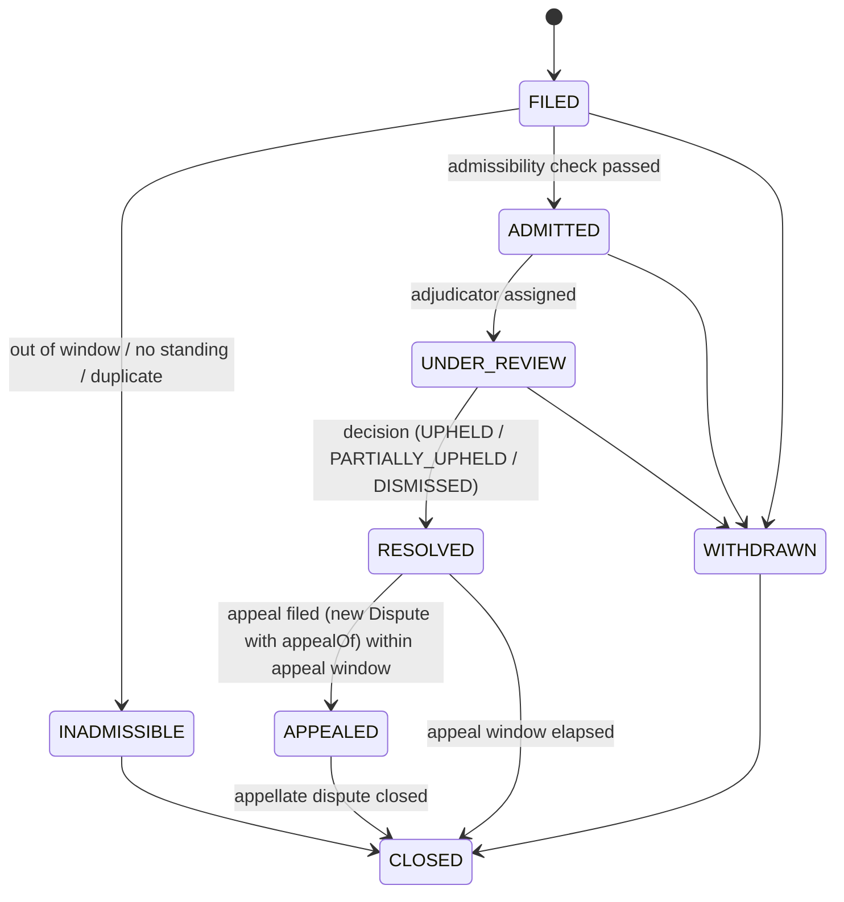

# BRT-01 — Disputes, Corrections & Revocation

| Field | Value |
|---|---|
| Ticket | BRT-01 |
| Status | Proposed — for review |
| Depends on | [Result domain](./BRT-01-RESULT-DOMAIN.md), [Verification model](./BRT-01-VERIFICATION-MODEL.md) |
| Related ADRs | [0003](../adr/ADR-0003-immutable-versioned-results.md), [0007](../adr/ADR-0007-disputes-as-entities-not-states.md) |

**Governing principle:** *history is append-only*. Nothing verified is ever overwritten. Change is expressed only through four mechanisms:

- a **new version** that supersedes the old one;
- a **status entry** (revoked, suspended, rescinded) with reason and authority;
- a **new assessment** (verification, evidence assessment) that replaces the previous one as *current*, without deleting it;
- a **new downstream artefact** (achievement, record mark, prize adjustment) that references what it replaces.

---

## 1. Dispute

### 1.1 Entity

```
Dispute {
  disputeId
  subject: { subjectType: RESULT_VERSION | ATTESTATION | EVIDENCE | ACHIEVEMENT | RECORD_MARK | AUTHORITY_GRANT | PARTICIPANT_ENTRY, subjectId, subjectHash }
  grounds: SCORING_ERROR | DATA_ENTRY_ERROR | RULES_MISAPPLIED | IDENTITY | ELIGIBILITY | EQUIPMENT_OR_CONDITIONS
         | EVIDENCE_INVALID | ATTESTER_COMPROMISED | OFFICIATING_DECISION | FRAUD | DOPING_SANCTION | OTHER
  filedBy: principalId
  filedByRole: PARTICIPANT | OPPONENT | OFFICIAL | ORGANIZER | SANCTIONING_BODY | PLATFORM | THIRD_PARTY
  filedAt
  window: ORDINARY | LATE | EXTRAORDINARY      // derived from filedAt vs subject status/protest window
  claimedRemedy?: { proposedResultVersionId? , requestedAction: CORRECT | REVOKE | REVIEW | RESCIND }
  evidenceRefs[]
  adjudicator?: principalId                      // assigned; must hold ADJUDICATE_DISPUTE for scope & be non-conflicted
  status                                         // §1.2
  statusHistory[]
  resolution?: { outcome: UPHELD | PARTIALLY_UPHELD | DISMISSED | WITHDRAWN,
                 actions[]: CorrectionRef | RevocationRef | AssessmentRef | RescissionRef,
                 reasoning, decidedBy, decidedAt, resolutionAttestationId }
  appealOf?: disputeId
}
```

### 1.2 Dispute lifecycle



| Transition | Who | Rule |
|---|---|---|
| file | Any principal with *standing*: a participant or opponent in scope, an official, the organizer, a sanctioning body or the platform. Third parties may file only `FRAUD`, `EVIDENCE_INVALID` or `ATTESTER_COMPROMISED`. | Evidence is recommended; standing is checked |
| admit / inadmissible | The adjudicator of the scope, or an automated rule for window and standing checks | Windows are defined below |
| resolve | An adjudicator with `ADJUDICATE_DISPUTE` who is not conflicted and not the author of the disputed act (for example, the referee who declared a result cannot adjudicate a protest about it) | The resolution is attested |
| appeal | The losing party | Heard by a principal with `APPEAL_ADJUDICATE` **higher** in the authority chain than the first adjudicator |

**Windows** are set by the Competition governance profile, with platform defaults:

| Window | When | Effect |
|---|---|---|
| `ORDINARY` | While the subject is PROVISIONAL or OFFICIAL and inside its protest window, whose closing condition is configured by the competition (result domain §5.1). *Illustrative policy:* the padel walkthrough closes a bracket match's window when the next dependent contest starts. | Creates a **hold** when admitted |
| `LATE` | After FINAL, within a late-review period (e.g. 90 days) | Hold applies only to *unexecuted* consequences; requires elevated authority to correct |
| `EXTRAORDINARY` | Any time | Only for `FRAUD`, `DOPING_SANCTION`, `ATTESTER_COMPROMISED` or `EVIDENCE_INVALID`; requires elevated authority |

### 1.3 Hold semantics

- **When a hold exists.** An **admitted** dispute places a `hold` on its subject and on every artefact whose basis includes the subject. It lasts until resolution or withdrawal.
- **What a hold blocks:** new downstream consequences whose permission-matrix row says "hold blocks". That covers payout release, record ratification, trophy minting, official rankings inclusion and transitions T5 and T6.
- **What a hold does not do:**
  - It does **not** change the result version's status.
  - It does **not** by itself change the verification level. The level changes only if an attestation is revoked or evidence is invalidated.
- **Display.** Existing public displays show an "under dispute" marker.

---

## 2. Correction

### 2.1 Entity

```
Correction {
  correctionId
  resultId
  supersededVersionId
  newVersionId
  correctionType: CLERICAL | ADJUDICATED | SANCTION | RECLASSIFICATION | REINSTATEMENT | AUTHORITY_OVERRIDE
  grounds, disputeId?
  issuedBy: principalId, grantId, attestationId   // the correcting authority attests the new version
  effectiveAt                                      // when the new version becomes current
  diff                                             // machine-readable delta between versions (entries, performances, outcomes)
  downstreamImpact                                 // computed impact report (§5), stored with the correction
}
```

### 2.2 Correction types

| Type | Example | Authority required |
|---|---|---|
| `CLERICAL` | A bowling game was typed as 199 but the scoresheet shows 189 | `CORRECT_RESULT` in scope. If FINAL: `ELEVATED_CORRECT` |
| `ADJUDICATED` | A protest is upheld and the padel set score is corrected | The dispute resolution; adjudicator authority |
| `SANCTION` | DQ for an equipment violation, a doping sanction or a point deduction | Sanctioning authority or the disciplinary body in scope |
| `RECLASSIFICATION` | An entry was placed in the wrong category (senior vs open) | Organizer or sanctioning body |
| `REINSTATEMENT` | A revoked result is restored after an appeal | Appellate authority |
| `AUTHORITY_OVERRIDE` | A federation corrects an organizer-certified result | An authority with precedence (§2.4) |

### 2.3 Semantics

1. **The old version is not modified.** It transitions to `SUPERSEDED` (T7). Its attestations remain `ACTIVE`, but they apply only to the old hash. They are historical truth about what the event had certified.
2. **The new version** carries `supersedes` and `correctionId`, a fresh `contentHash`, and the correcting authority's attestation. All other attestations must be re-issued (R-5).
3. **Initial status of the new version** follows result domain §7.4.
4. **Verification is recomputed** for the new version from scratch. The new level may be **lower** than the old one's until the other parties re-attest. Downstream consumers see a level change, and `downstreamImpact` records what that affects.
5. **Classifications that derive from the corrected version** become `stale` and are re-derived as new versions (R-6), following the same correction path.

### 2.4 Authority precedence

Within one scope's anchor chain, precedence for `DECLARE_OFFICIAL` and correction is ordered from highest to lowest:

1. **Appellate adjudicator**
2. **Sanctioning body**
3. **Organizer**
4. **Delegated official**
5. **Accredited system**

A lower authority cannot supersede a version declared or corrected by a higher one. A higher authority can supersede a lower one's version with an `AUTHORITY_OVERRIDE`, and must record its grounds.

**Cross-anchor conflicts are not resolved automatically.** An example is two federations recognizing the same event. The platform flags them for governance, and each anchor's view stays visible.

---

## 3. Revocation

**Revocation** annuls without replacement. It applies to each kind of entity as follows:

| Entity | Meaning of revoke | Effect |
|---|---|---|
| ResultVersion (T8) | The contest is treated as not having produced a valid result: fabricated, not held, or voided by rule | The Result has no current version; dependent classifications are re-derived; downstream per §5 |
| Attestation | The issuer (or a higher authority) withdraws it, or it is found fraudulent | Status `REVOKED`; verification is recomputed |
| AuthorityGrant | Ordinary (prospective) or compromise (retroactive to *t₀*) | See verification model §4.7 and §4.2 below |
| Key | Compromise | Attestations signed after `compromisedSince` become `SUSPECT` |
| Achievement | Its basis is invalidated with no replacement | Status `REVOKED`; trophies and records per §5 |
| RecordMark | `RESCINDED` | The previous mark is restored (RC-3) |

**Reinstatement** is never "un-revoke". It is a new version, or a new achievement, created by a `REINSTATEMENT` correction.

---

## 4. Scenario semantics

### 4.1 Invalid evidence

1. A dispute or review (or an automated integrity check) produces `EvidenceAssessment{finding: INTEGRITY_FAILED | MANIPULATED | WRONG_SUBJECT}`.
2. All result versions linking that evidence are re-verified. The evidence no longer satisfies any criterion, so the level may drop.
3. **If the level falls below a consequence's minimum**, those consequences are **suspended** (not auto-revoked) and a review is queued. The authority then either:
   - supplies replacement evidence (the level recovers), or
   - revokes or corrects the result.
4. **If manipulation implicates an attester**, a `FRAUD` dispute is opened against that attester's other attestations.

### 4.2 Compromised attester

1. A key or grant is revoked with `compromise: true, effectiveFrom = t₀`.
2. Every attestation by that key or grant with `issuedAt ≥ t₀` becomes `SUSPECT`. The status change is appended.
3. Verification is recomputed for all affected versions, and `SUSPECT` attestations do not count.
4. Consequences whose basis now fails the minimum are **suspended**. The platform creates review items, grouped by competition, for the relevant authorities.
5. **Attestations before *t₀* remain valid** unless separately disputed. The system never assumes that everything the attester ever signed is bad; it assumes only what the evidence of compromise supports.

### 4.3 Federation correction

A sanctioning body issues an `AUTHORITY_OVERRIDE` correction after the organizer declared the result OFFICIAL or FINAL. For example, the federation applies a handicap rule differently.

- The new version supersedes the old one, with the federation's attestation.
- The verification of the new version typically meets V3 immediately, because the federation is the anchor.
- Downstream re-derivation follows §5.
- The organizer's original certification stays in history as a SUPERSEDED version with its attestations.

### 4.4 Disputed result

- **Before FINAL:** the dispute is ORDINARY, the hold blocks progression to FINAL, and the resolution produces a correction, a revocation, or nothing (dismissed).
- **After FINAL:** the dispute is LATE or EXTRAORDINARY. The hold affects only consequences not yet executed.

### 4.5 Result overturned after prize issuance

**Prize clawback is not implemented.** Only the semantics are defined here; see §5.5.

---

## 5. Downstream consequences of correction and revocation

When a correction or revocation takes effect, the platform computes a **DownstreamImpact report**: the set of artefacts whose basis includes a superseded or revoked version or a suspect attestation. It then applies the following:

### 5.1 Achievements

| Situation | Action |
|---|---|
| The achievement's basis is still satisfied by the new version (e.g. a clerical fix that doesn't change the winner) | New achievement issued with the new basis; old one `SUPERSEDED`, `supersededBy` linked. Same type, holder and scope. The display treats this as continuity. |
| The holder changes (e.g. the winner is overturned) | Old achievement `REVOKED` (reason, correctionId); new achievement issued to the new holder, `supersedes` the old one |
| No replacement (the result is revoked) | Old achievement `REVOKED` |
| Level temporarily below the minimum (awaiting re-attestation) | `SUSPENDED` (not revoked); automatically reactivated as a new status entry when the level recovers |

### 5.2 Rankings

- **Ranking snapshots are immutable publications.** A correction triggers a **recomputation from the effective date forward**, which produces new snapshots that carry `correctsSnapshotIds`.
- **Two views are exposed.** *As-published* is historical and shows what was believed at the time. *As-corrected* is current truth.
- **Nothing is silently rewritten.**
- **Ranking-derived achievements** (`RANKING_MILESTONE`) follow §5.1 against the as-corrected view.

### 5.3 Records

| Situation | Action |
|---|---|
| A record mark's basis achievement is revoked or superseded with a lower value | Mark `RESCINDED`; the previous mark is restored as current by an appended status entry that re-opens its effective period (the earlier `effectiveTo` value stays in `statusHistory`); any marks set in between are re-evaluated in chronological order |
| The corrected value is still a record | New mark (ratification required again if the category needs V4); old mark `SUPERSEDED` |
| A mark is pending ratification when a dispute is admitted | Ratification blocked by the hold |

### 5.4 Trophies (semantics for M13; not implemented)

- **The registry is the source of truth.** A trophy's validity is the status of its `achievementId`. A trophy whose achievement is `REVOKED` or `SUPERSEDED` is displayed as **revoked** or **replaced** everywhere the platform renders it.
- **Non-transferable (credential-class) trophies.** The issuer should be able to revoke or burn them. The specific mechanism is deferred to the Trophy House design.
- **Transferable (collectible-class) trophies**, if they exist at all, cannot be recalled from third-party holders. Their metadata must resolve verification status dynamically from the registry, and must never embed "verified: true". This is why BRT-00 §4.1 flagged the "sell or trade" conflict. See the data boundaries doc.
- **Replacement trophies** for a new holder are new tokens referencing the new achievement. The old token is never re-assigned.

### 5.5 Prizes (semantics only; clawback not implemented)

**PrizeEntitlement** is defined here for the Prize Rail (M12) to implement later:

```
PrizeEntitlement { entitlementId, prizeTermsId, achievementId (basis), beneficiary, amount, asset,
                   status: PENDING | HELD | PAYABLE | PAID | VOIDED | ADJUSTMENT_REQUIRED, statusHistory[] }
```

| Situation | Semantics |
|---|---|
| Correction **before payout** | The entitlement is VOIDED and a new entitlement created for the correct beneficiary. No value has moved. |
| Dispute admitted **before payout** | Entitlement `HELD` |
| Correction **after payout** (`PAID`) | Entitlement → `ADJUSTMENT_REQUIRED`. The platform records a **PrizeAdjustment** obligation: `{owedTo: newBeneficiary, amount, recoverableFrom: priorBeneficiary, status: OPEN}`. **No automatic clawback, and no automatic second payment from other funds.** Resolution (funder top-up, voluntary return, insurance reserve, legal) is a Prize Rail policy decision for a later phase. |
| Why payouts wait for FINAL | FINAL is a necessary (not sufficient) condition. Payout also requires the level declared in the prize terms and no active hold, and executes only as those terms direct. Waiting for FINAL (after the protest window) makes post-payout overturns rare: only LATE or EXTRAORDINARY grounds can cause them. This directly addresses BRT-00 C-6/H-1, where legacy contracts paid on first declaration. |

### 5.6 Operational consequences (brackets)

- **Advancement already applied**, with the dependent contest **not started:** the correction re-seeds the dependent Contestant slot.
- **Dependent contest already started or completed:**
  - Where the competition's policy closes the protest window when the dependent contest starts (as in the padel walkthrough), corrections that would change who advanced are **not permitted as ORDINARY** after that point. Under other configured closing conditions, the ORDINARY window is whatever the policy defines.
  - They are possible only as LATE or EXTRAORDINARY rulings. Those rulings produce a *sporting* remedy decided by the authority (void the downstream contests, replay, or award without replay), expressed as corrections or revocations of the affected contests.
  - The model **records** the decision. It does not invent a sporting remedy.

---

## 6. Invariants

| ID | Invariant |
|---|---|
| D-1 | No entity in the trust or consequence layers is ever deleted or edited in place. |
| D-2 | Every correction, revocation and resolution is attested by a principal with the required capability, and references its grounds. |
| D-3 | A dispute cannot be adjudicated by a conflicted principal or by the author of the disputed act. |
| D-4 | An admitted dispute holds all unexecuted consequences whose permission row says "hold blocks". |
| D-5 | Downstream impact is computed and stored with every correction and revocation. Consumers can always explain *why* an artefact changed. |
| D-6 | A value transfer that has already executed is never reversed by the domain. It is represented as an adjustment obligation. |
