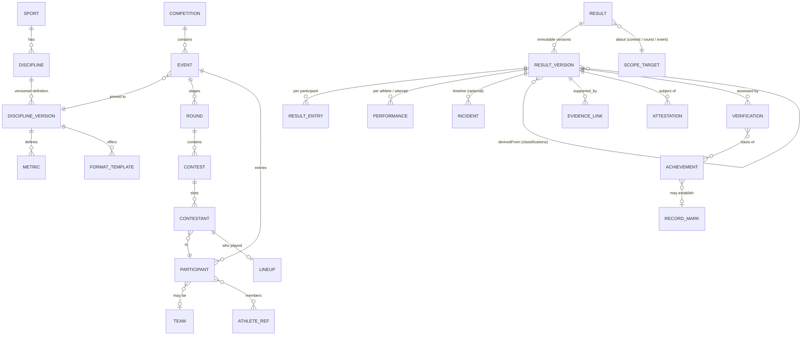
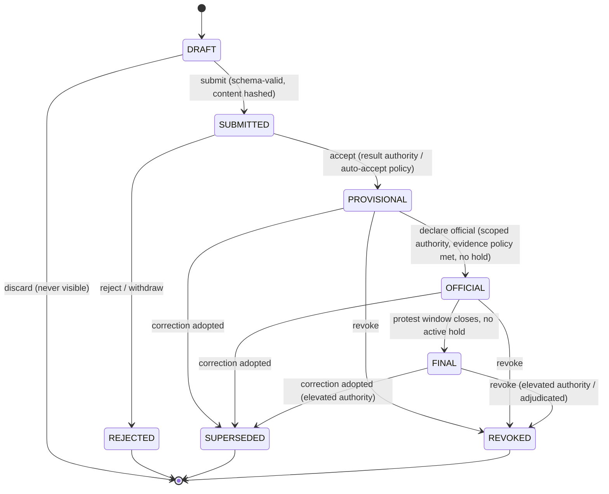

# BRT-01 — Result Domain

| Field | Value |
|---|---|
| Ticket | BRT-01 |
| Status | Proposed — for review |
| Baseline | [BRT-00 archaeology](../archaeology/BRT-00-REPOSITORY-ARCHAEOLOGY.md), [salvage matrix](../archaeology/BRT-00-SALVAGE-MATRIX.md), [capability map](../architecture/BRT-TARGET-CAPABILITY-MAP.md) |
| Companion docs | [Verification model](./BRT-01-VERIFICATION-MODEL.md) · [Disputes & corrections](./BRT-01-DISPUTES-AND-CORRECTIONS.md) · [Data boundaries](../architecture/BRT-01-DATA-BOUNDARIES.md) · [Bowling walkthrough](../examples/BRT-01-BOWLING-WALKTHROUGH.md) · [Padel walkthrough](../examples/BRT-01-PADEL-WALKTHROUGH.md) · [ADRs](../adr/) |

This document is a **model**. It is not a schema, API or contract. Field lists define meaning, not storage. Pseudo-structures use JSON-like notation only for illustration.

---

## 1. The question this domain answers

> *Why should anyone trust that this athlete actually achieved this result?*

The answer is always a **chain of references**, never a flag:

```
Result version (exact, content-hashed)
  ◄── Evidence       (what was captured, by what source, with what integrity)
  ◄── Attestations   (who, under what authority, asserted what about it)
  ◄── Verification   (what trust level the platform's policy assigns to that combination)
  ──► Verified Achievement (a derived fact that references all of the above)
```

BRT-00 (§17–18) found that every legacy system collapsed this chain into a single privileged key that declared winners. The model below prevents that structurally:

- a Result cannot certify itself;
- an Attestation is worthless without scoped Authority;
- a Verification is only ever *computed*, never *asserted*.

---

## 2. Design principles

1. **Sport-neutral core, sport-specific definitions.** The core has no bowling pins, padel sets or race times as fields. Sport semantics live in versioned **Discipline definitions**: metrics, result schemas, comparators and validation rules.
2. **Results are versioned and immutable once submitted.** Change means a new version. See [ADR-0003](../adr/ADR-0003-immutable-versioned-results.md).
3. **Result ≠ Achievement.** A Result records what happened. An Achievement is a derived, rule-based recognition of a verified result. See [ADR-0001](../adr/ADR-0001-separate-result-and-achievement.md).
4. **Evidence ≠ Attestation ≠ Verification.** See [ADR-0002](../adr/ADR-0002-separate-evidence-attestation-verification.md).
5. **Operational progress ≠ verified truth.** A bracket must be able to advance on a provisional result without the platform pretending that result is verified. See [ADR-0008](../adr/ADR-0008-operational-progression-decoupled-from-verification.md).
6. **Identity lives elsewhere.** The Result domain references Athletes, Teams and Principals by id. Person/Athlete identity, PII and wallets belong to the Athlete Passport and Identity modules (M1/M2). See [data boundaries](../architecture/BRT-01-DATA-BOUNDARIES.md).

---

## 3. Entity map



### 3.1 Summary table

| Entity | Layer | One-line responsibility | Mutable? |
|---|---|---|---|
| **Sport** | Ontology | Top-level grouping (bowling, padel, athletics) | Curated, append-only |
| **Discipline** | Ontology | A contested form with one scoring logic (ten-pin singles, padel doubles, 100 m) | Curated |
| **DisciplineVersion** | Ontology | Versioned rules: metrics, result schema, comparator, validation, evidence policy hints | Immutable once published |
| **Metric** | Ontology | Typed measurable quantity (`bowling.game.pins`, `athletics.time`) | Immutable per version |
| **FormatTemplate** | Ontology | Reusable structure (round-robin, knockout, americano, heats + final, qualifying + brackets) | Immutable per version |
| **Competition** | Operations | An organized edition under an organizer (e.g. *Torneo La Negrita 2025*) | Mutable metadata; lifecycle-governed |
| **Event** | Operations | One discipline + category contest inside a Competition that produces a final classification | Config frozen at start |
| **Round** | Operations | A stage of an Event (qualifying, group, heat, knockout round, final) | Config frozen at start |
| **Contest** | Operations | The atomic unit that produces a Result: a match, heat, series/session, routine or attempt set | Schedule mutable until start |
| **Participant** | Operations | An entry into an Event: an individual or a team, with entry attributes (category, seed, handicap basis) | Frozen at event start (amendments versioned) |
| **Team** | Identity-adjacent | A persistent or ad-hoc collective identity (a club side, a padel pair) | Membership changes are versioned |
| **Contestant** | Operations | A Participant's slot in a specific Contest (side A/B, lane, heat position, bib) | Frozen at contest start |
| **Lineup** | Operations | The athletes who actually took part for a Contestant in a Contest | Part of the Result content |
| **Result** | Result | Logical identity of "the outcome of X", which owns versions | Pointer to the current version only |
| **ResultVersion** | Result | An immutable, content-hashed snapshot of an outcome, with a lifecycle status | Content immutable after SUBMITTED |
| **ResultEntry** | Result | One participant's line in a result version: outcome, rank, primary mark, components | Immutable (part of version) |
| **Performance** | Result | An individual measurement within a contest (a game, attempt, lap, judge score, player stat) | Immutable (part of version) |
| **Incident** | Result | Optional timeline decision (goal, card, point, foul, false start) | Immutable (part of version) |
| **Evidence**, **Attestation**, **Authority**, **Verification** | Trust | See the [verification model](./BRT-01-VERIFICATION-MODEL.md) | Append-only |
| **Achievement** | Consequence | Rule-derived recognition of verified facts | Append-only status changes |
| **RecordCategory**, **RecordMark** | Consequence | A defined comparison universe and its holders over time | Append-only |
| **Dispute**, **Correction** | Governance | See [disputes & corrections](./BRT-01-DISPUTES-AND-CORRECTIONS.md) | Append-only |

---

## 4. Ontology layer: making sports data, not columns

### 4.1 Metric

A Metric is a typed quantity with fixed semantics:

```
Metric {
  metricId: "bowling.game.pins"        // globally unique, namespaced by sport
  valueType: INTEGER | DECIMAL | DURATION | LENGTH | MASS | POINTS | ORDINAL | BOOLEAN | COMPOSITE
  unit: "pins" | "ms" | "cm" | "kg" | "pts" | …   // SI or declared sport unit
  precision: 0                          // decimal places / time resolution
  direction: HIGHER_IS_BETTER | LOWER_IS_BETTER | NOT_RANKED
  bounds: { min: 0, max: 300 }          // validation only
  componentSchemaRef?: "…"             // for COMPOSITE (e.g. padel set scores, judge panels)
}
```

**Values are carried as a `Mark`:** `{ metricId, value, unit, precision, qualifiers? }`.

- The value is serialized as a decimal string or an ISO-8601 duration to avoid float drift. BRT-00 M-3 found 18- vs 6-decimal confusion in the legacy code.
- `qualifiers` carries condition data the discipline needs for comparison, such as wind reading, equipment class or hand-timed vs fully automatic.

### 4.2 DisciplineVersion

A DisciplineVersion defines:

- **Result schema.** A typed structure for `ResultEntry.components` and `Performance`. It defines what a valid padel score or bowling series looks like. It is expressed as a schema document (e.g. JSON Schema) and referenced by id and version.
- **Outcome model.** Which of `RANKED`, `WIN_LOSS_DRAW`, `SCORED_RANKED` or `JUDGED_RANKED` applies.
- **Comparator.** An ordered list of tie-break keys, e.g. bowling standings: `average desc, total pins desc, highest series desc`, as found in legacy `../padelflow/scripts/create-results-system-fixed.sql`.
- **Validation rules.** For example, a padel set must be won by 2 games or by tiebreak; a bowling game must be ≤ 300.
- **Evidence expectations.** The evidence types that count as *primary* for this discipline. The verification policy consumes these; see the verification model §6.
- **Achievement rule hooks.** Named thresholds (e.g. `perfect_game = 300`) that Achievement rules may reference.

**Invariant O-1.** An Event is pinned to exactly one DisciplineVersion when it opens. Rule changes create a new DisciplineVersion and never retroactively alter existing results.

### 4.3 FormatTemplate

A FormatTemplate describes a Round graph and advancement rules: round-robin groups with *k* qualifiers, single or double elimination, heats → semis → final, qualifying series → brackets, americano rotation. It carries parameters such as group count, qualifiers per group, sets per match, points for win/draw/loss and duration.

The legacy padel wizard (`../padelflow/public/mvp/app.js` L293–393) is the vocabulary source for padel formats. The legacy bowling round seed (`Ronda Clasificatoria`, `Llaves A…I`) is the source for bowling.

---

## 5. Operations layer

### 5.1 Competition

- **What it is:** an organized edition, e.g. *Torneo La Negrita 2025* or a padel club open.
- **Holds:** organizer Principal, optional sanctioning Principal(s), period, venue refs, visibility, and a **governance profile**. The governance profile sets the protest windows, submission policy and minimum verification levels for the competition's own consequences. Protest windows are configurable per competition, and per round where overridden. Each is defined by a duration and/or closing conditions, for example "N minutes after OFFICIAL", "when a dependent contest starts", or "explicit closure by the result authority". The domain prescribes no single closing rule.
- **Holds no results directly.**

### 5.2 Event

- **What it is:** one Discipline + one category inside a Competition, e.g. "Scratch Singles", "Handicap Singles" or "Padel Mixed A".
- **Holds:** `disciplineVersionId`, `category` (a typed set of eligibility constraints such as gender class, age group, weight class, level or handicap/scratch), `formatTemplateId` + parameters, and entry rules.
- **Produces:** an **Event classification** Result (the final standings or podium).

### 5.3 Round

- **What it is:** a stage of an Event. `roundType` is one of `QUALIFYING | GROUP | HEAT | KNOCKOUT | REPECHAGE | FINAL | SESSION`.
- **Holds:** order, advancement rules (from the FormatTemplate), and a protest-window override.
- **May produce** a **Round classification** Result (group table, heat ranking, qualifying standings).

### 5.4 Contest

- **What it is:** the atomic producer of a Result.
- **`contestType`** is one of:

| `contestType` | Typical use |
|---|---|
| `MATCH` | Head-to-head: padel, tennis, boxing, football |
| `HEAT` | Many contestants racing together |
| `SERIES` | A block of games: a bowling 3-game series, a golf round |
| `ATTEMPT_SET` | Field events or lifting: attempts per athlete |
| `ROUTINE` | A judged performance |
| `SESSION` | Open time-boxed contest: americano rotation slot, time-trial window |

- **A "Match" is a Contest with `contestType = MATCH`.** The core needs no separate Match entity, because every contest type shares the same lifecycle and trust chain.
- **Holds:** schedule, venue/court/lane, Contestants, and officials assigned (as Principal refs, whose authority lives in the Authority model).
- **Owned by exactly one Round.** Classifications of *other* Events in the same Competition may still derive from it when their format parameters declare it. This **cross-event derivation** covers cases such as one bowling series counting for both the scratch and the handicap events. Contest results are never duplicated.

### 5.5 Participant (Participation / Entry)

- **What it is:** an entry in an Event.
  - `kind = INDIVIDUAL` references one Athlete.
  - `kind = TEAM` references a Team and a declared roster.
- **Entry attributes** are typed by the Discipline and category. Examples: `seed`, `handicapBasis` (bowling: entering average, *with its own evidence*), `weightAtWeighIn` (combat), `bib`.
- **Is not the Athlete.** Registration payment, contact data and eligibility documents live in the Registration and Passport modules and are referenced by id.

### 5.6 Team and Lineup

- **Team** is an identity: a persistent club side, or an ad-hoc pair for padel. Membership is versioned over time.
- **Lineup** records who actually played in a specific Contest for a Contestant, including substitutions. It is part of the Result content because achievements credit athletes through it.

### 5.7 Contestant

- **What it is:** the link between a Participant and a Contest.
- **Holds:** slot (`side: A|B`, `lane: 7`, `position`, `startOrder`).
- **Frozen at contest start.** Changes after that time require a correction.

---

## 6. Result layer

### 6.1 Result and ResultVersion

```
Result {
  resultId
  scope: CONTEST | ROUND_CLASSIFICATION | EVENT_CLASSIFICATION | COMPETITION_CLASSIFICATION
  scopeTargetId                  // contestId / roundId / eventId / competitionId
  currentVersionId               // the effective version (moves only via lifecycle rules)
}

ResultVersion {
  resultVersionId
  resultId
  versionNumber                  // 1, 2, 3 … (monotonic)
  disciplineVersionId            // copied from Event; content validated against it
  status                         // see §7
  content: {
    entries: ResultEntry[]
    performances: Performance[]
    incidents?: Incident[]
    lineups?: Lineup[]
    conditions?: { … }           // weather, surface, equipment class (typed by discipline)
    derivedFrom?: ResultVersionRef[]   // for classifications
    derivationRuleId?            // e.g. comparator + format advancement rule version
  }
  contentHash                    // canonical serialization hash (see verification model §2.4)
  createdBy: PrincipalRef        // who drafted it
  submittedBy?: PrincipalRef
  submittedAt?
  supersedes?: ResultVersionRef  // previous version this one replaces (set by a Correction)
  correctionId?                  // the Correction that created it (if any)
  statusHistory: StatusChange[]  // append-only
}
```

**Why a derived classification is also a Result.** The final standing of an Event ("1st: pair X") is itself a claim that needs authority, attestation and dispute handling. Standings computed by a trigger with no provenance was the legacy pattern (`update_player_standings`). Here a classification is a ResultVersion whose `derivedFrom` pins the exact contest result versions it was computed from.

### 6.2 ResultEntry

This is the per-participant line in a version.

```
ResultEntry {
  participantId
  contestantSlot?               // for CONTEST scope
  outcome: WIN | LOSS | DRAW | RANKED | DNS | DNF | DQ | WALKOVER_WIN | WALKOVER_LOSS | RETIRED | NO_CONTEST
  rank?: integer                // 1..n; ties share rank; absent for unranked outcomes
  tieBreakKeys?: Mark[]         // values used by comparator, in comparator order
  primaryMark?: Mark            // the headline value (series total, time, distance, points)
  components?: object           // discipline-schema-typed (sets, games, rounds, judge breakdown)
  advancement?: { toRoundId, toContestId?, slot? }   // outcome of format rules (operational)
  penalties?: Penalty[]         // typed; e.g. time penalty, point deduction, DQ reason code
}
```

### 6.3 Performance

A Performance is an **individual measurement**. It lets achievements target the atomic act (a perfect game, a personal-best attempt) without duplicating the result.

```
Performance {
  performanceId                 // stable within the result lineage (survives versions for diffing)
  participantId
  athleteId?                    // when a team participant's member performed
  ordinal?                      // game 1..3, attempt 1..6, lap n
  mark: Mark
  components?: object           // e.g. frames, judge scores (judgeRef + score)
  valid: boolean                // attempt fouled / game void
}
```

### 6.4 Incident

An Incident is an optional timeline decision:

```
Incident { incidentId, at (clock or sequence), type (discipline-typed: GOAL, CARD, POINT, FOUL, FALSE_START…), actors[], data, evidenceRefs? }
```

- **Why incidents exist now:** they give future AI officiating (M19) and video evidence (M7) a granular subject. BRT-00 capability map §7 calls this "decision granularity".
- **They are optional.** A discipline may require them (e.g. cards for a football disciplinary record), or leave them out.

### 6.5 Which content belongs where

| Question | Home |
|---|---|
| Who entered, in which category, with what handicap basis? | Participant |
| Who played in this specific match? | Lineup (in ResultVersion) |
| What happened (score, time, outcome, rank)? | ResultEntry / Performance / Incident (in ResultVersion) |
| Who is allowed to certify it? | Authority (not in Result) |
| What proves it? | Evidence (linked, not embedded) |
| Who vouches for it? | Attestation (references the version hash) |
| How much should we trust it? | Verification (computed) |
| What recognition follows? | Achievement / RecordMark (derived) |
| What operational consequence follows (advancement)? | `ResultEntry.advancement`, applied by the Competition Engine to later Contestants |

---

## 7. Result lifecycle

### 7.1 States: what is kept and what is dropped

The prompt suggested DRAFT, SUBMITTED, PROVISIONAL, ATTESTED, VERIFIED, OFFICIAL, DISPUTED, CORRECTED and REVOKED. The analysis below keeps the distinctions that change *who may act* or *what may follow*, and drops the rest.

| Candidate | Decision | Reason |
|---|---|---|
| DRAFT | **Keep** | Editable work in progress; must not be attestable or visible |
| SUBMITTED | **Keep** | Content frozen and hashed; a claim awaiting acceptance by the event's result authority. This separates "someone says" from "the event has accepted". |
| PROVISIONAL | **Keep** | Accepted by the event for operational purposes: live standings, bracket advancement. Still protestable. |
| ATTESTED | **Drop as a state** | Attestations accumulate independently and can be revoked. A version can have zero or many. As a state it would be lossy and race-prone. It becomes a *property* derived from the attestation set. |
| VERIFIED | **Drop as a state** | Verification is a computed level (V0–V4) that can go up or down without the result changing. Making it a state would conflate trust with process. See [ADR-0005](../adr/ADR-0005-criteria-based-verification-levels.md). |
| OFFICIAL | **Keep** | Declared official by the scoped result authority. The protest window starts. |
| FINAL | **Add** | The protest window has closed with no admitted open dispute (no active hold). It is a *necessary but not sufficient* gate for irreversible consequences such as payouts. Payout also requires the level and conditions declared in the prize terms (verification model §7). Real sport distinguishes "official" from "final/confirmed", and BRT-00 H-1/C-6 showed why payouts must not fire on first declaration. |
| DISPUTED | **Drop as a state; model as a Dispute entity plus a derived `hold` flag** | A dispute can hit a PROVISIONAL, OFFICIAL or FINAL version. As a state it would erase which of those the version was in, and multiple concurrent disputes would be unrepresentable. See [ADR-0007](../adr/ADR-0007-disputes-as-entities-not-states.md). |
| CORRECTED | **Replace with SUPERSEDED on the old version** plus a new version | Corrections never mutate. The old version becomes SUPERSEDED, and the new version carries `supersedes` and `correctionId`. |
| REVOKED | **Keep** | The outcome is annulled with no replacement (contest void, fabricated, not held). This is different from supersession. |
| REJECTED | **Add** | A submission refused, or withdrawn before acceptance. Keeps the audit trail without polluting the result history. |

**Final set:** `DRAFT → SUBMITTED → PROVISIONAL → OFFICIAL → FINAL`, with the terminal states `REJECTED`, `SUPERSEDED` and `REVOKED`.

### 7.2 State diagram



### 7.3 Transition rules

"Result authority" means a Principal holding the relevant capability through a valid, scoped, non-conflicted Authority grant for this Contest, Round or Event (see the verification model §4).

| # | Transition | Initiator | Preconditions | Required evidence | Reversible? |
|---|---|---|---|---|---|
| T1 | create → DRAFT | Any principal allowed by the Event's **submission policy**: scorer, official, participant, accredited system | Contest exists | None | Discardable |
| T2 | DRAFT → SUBMITTED | The drafter | Content validates against the DisciplineVersion schema; `contentHash` computed; content frozen | Policy may require ≥1 evidence link (e.g. a scorecard photo for self-submissions) | No. Fixing it needs rejection and a new draft, or a correction later. |
| T3 | SUBMITTED → PROVISIONAL | Holder of `ACCEPT_RESULT` for the scope; **or** automatic under a declared auto-accept rule (e.g. both head-to-head sides confirm, or an accredited scoring system submits) | No other PROVISIONAL+ version is current for the same Result | As policy | No |
| T4 | SUBMITTED → REJECTED | Holder of `ACCEPT_RESULT` (with reason); **or** the submitter (withdraw) | — | — | No (terminal) |
| T5 | PROVISIONAL → OFFICIAL | Holder of `DECLARE_OFFICIAL` for the scope. The declarer must not be conflicted (see verification model §4.5). | Contest complete; discipline **official evidence set** linked; no admitted open dispute (`hold = false`); for classifications, all `derivedFrom` versions are OFFICIAL or FINAL | Discipline official evidence set | No |
| T6 | OFFICIAL → FINAL | System, when the protest window's configured closing condition is met; **or** holder of `DECLARE_OFFICIAL` if all parties waive | No admitted open dispute (`hold = false`); for classifications, all inputs FINAL | — | No |
| T7 | {PROVISIONAL, OFFICIAL, FINAL} → SUPERSEDED | Side effect of a **Correction** adopting a new version (see disputes doc §2) | For FINAL, the correction needs *elevated* authority (sanctioning body, or adjudicated dispute) | Correction must cite grounds and evidence | No; the new version carries forward |
| T8 | {PROVISIONAL, OFFICIAL, FINAL} → REVOKED | Holder of `REVOKE_RESULT` (FINAL requires elevated authority); platform governance for fraud | Recorded reason | Grounds evidence | No. Reinstatement is a new version via Correction type `REINSTATEMENT`. |

### 7.4 Status of a new version created by correction

- A correction's new version **starts at the status its predecessor had.** For example, correcting an OFFICIAL version creates an OFFICIAL version.
- **Condition:** the correcting authority holds the capability that status requires, and attaches its own attestation to the new version.
- **Otherwise** the new version enters as SUBMITTED and follows the normal path. In the meantime the Result's `currentVersionId` keeps pointing to the old version, which is not yet superseded.
- **Supersession is atomic with adoption:** the old version becomes SUPERSEDED at the same moment the new version becomes current.

---

## 8. Invariants

| ID | Invariant |
|---|---|
| R-1 | A ResultVersion's `content` and `contentHash` never change after SUBMITTED. |
| R-2 | At most one version per Result is *current*. The current version is never in DRAFT, SUBMITTED, REJECTED or SUPERSEDED, except that a Result with no accepted version has no current version. |
| R-3 | No state transition goes backwards. Undoing always creates a new version (Correction) or a terminal state (REVOKED). |
| R-4 | Every transition is recorded in `statusHistory` with actor, authority grant used, timestamp and reason. The record is append-only. |
| R-5 | Attestations bind to `(resultVersionId, contentHash)`. An attestation never carries over to a new version. |
| R-6 | A classification Result may reach OFFICIAL or FINAL only if every `derivedFrom` input is at least OFFICIAL or FINAL respectively. A correction to an input marks dependent classifications `stale`, which forces recomputation (disputes doc §5). |
| R-7 | Content validates against the Event's pinned DisciplineVersion. Unknown fields are rejected, not stored. |
| R-8 | A Participant appears at most once per Contest (in exactly one Contestant slot). An Athlete appears in at most one Participant per Event, unless the category explicitly allows it (e.g. re-entry events, see the bowling walkthrough). |
| R-9 | Result content contains **no PII**. Athletes are referenced by id only. Names are resolved at display time under privacy rules (data boundaries §3). |
| R-10 | The result domain never moves value and never mints. It only emits facts that downstream modules consume under the verification model's permission matrix. |

---

## 9. Coverage of sport families

| Family | Contest type | ResultEntry | Performance | Comparator / components | Notes |
|---|---|---|---|---|---|
| **A. Score-based** (bowling, golf, darts) | `SERIES` (bowling 3-game block, golf round), `MATCH` (darts legs) | `RANKED` with `primaryMark` = total | Each game, hole or leg | Bowling: `total desc` (`handicapTotal` for handicap events). Golf: `strokes asc`. Darts leg: `WIN_LOSS` | Handicap is an *entry attribute* with its own evidence, applied by the discipline's scoring rule |
| **B. Time-based** (running, swimming, cycling) | `HEAT`, `SESSION` (time trial) | `RANKED`, `primaryMark` = DURATION | Splits, laps | `time asc`; qualifiers: timing method (FAT/hand), wind, pool length | Timing systems are the canonical evidence and attestor sources |
| **C. Distance / measurement** (jumps, throws, weightlifting) | `ATTEMPT_SET` | `RANKED`, `primaryMark` = best valid attempt | Each attempt, with `valid` flag | `best desc, then second-best desc…`; weightlifting uses `total desc, bodyweight asc` | Weight class and wind are category/qualifier data |
| **D. Head-to-head** (padel, tennis, boxing, MMA) | `MATCH` | `WIN/LOSS/DRAW/WALKOVER/RETIRED/NO_CONTEST` | Optional per-player stats | components: sets/games (racket), rounds + method (KO/TKO/decision) for combat | Combat judges' cards are Performance components; a KO is an Incident |
| **E. Team sports** (football, basketball) | `MATCH` | Team outcome + `primaryMark` = goals/points | Per-player stats via Lineup | Group tables are classification Results: points, goal difference… | Lineups make individual achievements possible (appearances, goals) |
| **F. Judged** (gymnastics, surfing, combat scoring) | `ROUTINE` (or `HEAT` in surfing) | `RANKED` | Per-routine; judge scores as components `{judgeRef, score}` | Discipline rule (e.g. drop high/low, D + E scores) | Each judge's input can be separate evidence; the panel chief attests the aggregate |
| **G. Multi-stage** (brackets, heats, qualifiers, finals) | Any, organized in Rounds | Contest results + Round/Event classification Results | — | FormatTemplate advancement rules | Classification versions pin their inputs (R-6) |

**No family required a sport-specific column in the core.** All sport variability lives in DisciplineVersion schemas, metrics, comparators and FormatTemplates.

---

## 10. Relationship to downstream modules

| Consumer | Reads | Never does |
|---|---|---|
| Competition Engine (M4) | `advancement` from PROVISIONAL+ current versions | Treat advancement as verification |
| Verification (M8) | ResultVersion + evidence + attestations + authority | Mutate results |
| Achievement Registry (M9) | Current versions with a sufficient verification level and status | Copy raw results into achievements |
| Records (M10) | Achievements + RecordCategory definitions | Declare scope beyond the recognizing authority's scope |
| Rankings (M11) | Achievements / FINAL classifications | Rewrite published snapshots |
| Prize Rail (M12) | FINAL + level ≥ the prize terms' declared minimum + no hold, then executes only as the prize policy directs | Pay on PROVISIONAL or OFFICIAL; treat any verification level alone as a payment trigger |
| Trophy House (M13) | Achievements | Mint without an achievement reference |

Permissions are defined in the [verification model §7](./BRT-01-VERIFICATION-MODEL.md#7-downstream-permission-matrix).
