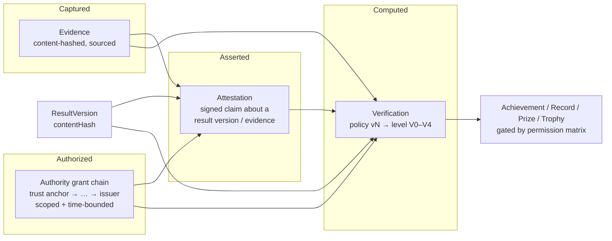

# BRT-01 — Verification Model

| Field | Value |
|---|---|
| Ticket | BRT-01 |
| Status | Proposed — for review |
| Depends on | [Result domain](./BRT-01-RESULT-DOMAIN.md) |
| Related ADRs | [0002](../adr/ADR-0002-separate-evidence-attestation-verification.md), [0004](../adr/ADR-0004-scoped-authority-and-delegation.md), [0005](../adr/ADR-0005-criteria-based-verification-levels.md), [0001](../adr/ADR-0001-separate-result-and-achievement.md) |

This document covers the following:

| § | Topic |
|---|---|
| §1 | Overview of the trust chain |
| §2 | **Evidence**: what was captured |
| §3 | **Attestation**: who asserts what |
| §4 | **Authority**: who may assert what, where, and when |
| §5 | **Verification**: what trust level the platform computes |
| §6 | Verification levels V0–V4, with formal criteria |
| §7 | Downstream permission matrix |
| §8 | **Verified Achievement** |
| §9 | **Records** |
| §10 | Future compatibility check |

---

## 1. Overview



**Who does what:**

- **Evidence** asserts nothing. It is data with provenance.
- **Attestations** are statements by accountable principals.
- **Authority** is what gives an attestation weight *for a specific scope*.
- **Verification** is a deterministic, re-computable function:

  `policy(resultVersion, evidence, attestations, authorityState, time) → level + reasons`.

  Verification is **never** a writable boolean. BRT-00 §17 identified exactly that as the legacy failure (`isDelivered` → `releaseFunds`).

---

## 2. Evidence

### 2.1 Definition

Evidence is an **immutable, content-addressed artefact** captured about a sporting occurrence, together with metadata about where it came from.

```
EvidenceItem {
  evidenceId
  evidenceType          // see §2.2
  contentHash           // multihash, e.g. sha2-256; the identity of the bytes
  hashAlgorithm
  byteSize
  mediaType?            // MIME (image/jpeg, video/mp4, application/json, text/csv, application/pdf)
  storageRefs[]         // one or more URIs (object store, IPFS CID, provider URL); all must resolve to the same hash
  source: {
    sourceKind          // HUMAN | ORGANIZATION | DEVICE | SCORING_SYSTEM | TIMING_SYSTEM | EXTERNAL_API | HISTORICAL_ARCHIVE | AI_PIPELINE
    sourcePrincipalId?  // registered principal (device, system, org, person) if known
    sourceSystem?       // product/system identifier + version (e.g. lane scoring system model/firmware)
    deviceId?           // for sensors / cameras / timing hardware
  }
  capturedAt            // claimed by source (may be untrusted)
  capturedAtAssurance   // SOURCE_CLAIMED | DEVICE_SIGNED | TRUSTED_TIMESTAMP
  submittedAt           // observed by platform (trusted)
  submittedBy           // principal who uploaded / pushed it
  integrity: {
    sourceSignature?    // signature by the source over contentHash (+ capturedAt, deviceId)
    signatureScheme?    // declared scheme id (e.g. ECDSA-secp256k1/EIP-191, Ed25519, COSE, X.509 CMS)
    signerKeyRef?       // key id registered to sourcePrincipalId
    timestampProof?     // optional RFC 3161 token or on-chain anchor reference
  }
  provenance: {
    derivedFrom[]?      // evidenceIds this was produced from (e.g. clip cut from full video)
    transformation?     // declared transform (crop, transcode, OCR, AI-extraction) + tool/version
    custodyLog[]        // append-only: {actor, action, at}
  }
  subjects[]            // links: {subjectType: CONTEST|RESULT_VERSION|PERFORMANCE|INCIDENT|PARTICIPANT_ENTRY, subjectId, role: PRIMARY|SUPPORTING|CONTEXT}
  privacyClass          // PUBLIC | PLATFORM_PRIVATE | AUTHORITY_ONLY  (see data boundaries)
  retentionPolicyId
  assessments[]         // append-only EvidenceAssessment (§2.5)
}
```

### 2.2 Evidence types

| `evidenceType` | Typical source | Example |
|---|---|---|
| `SCORING_SYSTEM_EXPORT` | Scoring system | Lane scoring export (frames, games) |
| `TIMING_SYSTEM_EXPORT` | Timing system | FAT results file, chip timing export |
| `SIGNED_SCORESHEET` | Human or official | Photo or PDF of a scorecard signed by players and referee |
| `OFFICIAL_REPORT` | Official or organizer | Referee match report, jury report |
| `FEDERATION_RECORD` | Federation API or document | Federation results publication |
| `PROVIDER_FEED` | External API | Data-provider JSON payload (stored verbatim) |
| `SENSOR_DATA` | Device | GPS track, IMU, force plate, radar |
| `VIDEO` / `IMAGE` / `AUDIO` | Camera, phone, broadcast | Match video, finish-line photo |
| `DOCUMENT` | Any | Lane or track certification, equipment inspection, anti-doping clearance |
| `HISTORICAL_ARCHIVE` | Archive | Scanned historical results |
| `OFFICIATING_SYSTEM_OUTPUT` | Registered officiating or measurement system | Line-call, machine-officiating or certified-camera decision output, device-signed (§2.6) |
| `AI_DERIVED` | Generic AI or CV pipeline that is **not** a registered, authorized measurement or officiating system | CV-extracted score or line call from uploaded or broadcast media, **with `derivedFrom` pointing to source media** (§2.6) |
| `MANUAL_ENTRY` | Human | Structured data typed into the platform (the weakest evidence type) |

### 2.3 Rules

| ID | Rule |
|---|---|
| E-1 | Evidence is immutable. A changed file is a new EvidenceItem, optionally `derivedFrom` the old one. |
| E-2 | `contentHash` is computed by the platform on ingestion. When a source provides a hash, it must match. |
| E-3 | `submittedAt` is platform time. `capturedAt` is a *claim* whose trust depends on `capturedAtAssurance`. |
| E-4 | `AI_DERIVED` evidence must reference its source media and its model/pipeline version. It can never be the only primary evidence for level V2 or above (§6). This rule does **not** apply to machine-generated evidence from a certified system (§2.6), whatever technique that system uses internally. |
| E-5 | Large payloads (video, sensor streams, documents) never go on-chain. At most a hash or commitment is anchored (data boundaries §4). |
| E-6 | Evidence carrying personal data (faces, minors, documents) defaults to `PLATFORM_PRIVATE` or `AUTHORITY_ONLY`. Public verifiability relies on the hash and on attestations, not on publishing the bytes. |

### 2.4 Independent integrity checking

A third party can check integrity **without trusting the platform**, provided it is granted access to the bytes:

1. Obtain the bytes from any `storageRef` and recompute `contentHash`.
2. Verify `integrity.sourceSignature` against the source's registered public key. The key registry is part of Authority (§4.1).
3. Verify `timestampProof` or an on-chain anchor that includes the hash (data boundaries §4).
4. Check that the attestations reference this `contentHash` and that the attestations' signatures verify.

**Canonical serialization.** ResultVersion content and attestation payloads are hashed over a *canonical serialization* (for example RFC 8785 JSON Canonicalization). This lets independent implementations reproduce `contentHash`. The exact choice is deferred to BRT-02.

### 2.5 EvidenceAssessment

An EvidenceAssessment is a finding about an evidence item. It is append-only and never edits the evidence itself.

```
EvidenceAssessment { assessmentId, evidenceId, finding: AUTHENTIC | INTEGRITY_FAILED | WRONG_SUBJECT | MANIPULATED | INCONCLUSIVE | SUPERSEDED_SOURCE, assessedBy, authorityGrantId?, method: AUTOMATED | HUMAN, at, notes, disputeId? }
```

An assessment of `INTEGRITY_FAILED` or `MANIPULATED` makes the evidence **invalid**. That triggers re-verification of every result version linked to it (disputes doc §4.1).

### 2.6 AI-derived versus machine-generated (certified system) evidence

The model distinguishes evidence by **provenance and authority**, not by the technique used to produce it.

| | `AI_DERIVED` | Machine-generated by a certified system |
|---|---|---|
| Examples | CV inference over a phone video; an LLM or OCR reading a scoresheet photo; an unregistered analytics service | Official timing system; lane scoring hardware; line-call system; sensors; machine-officiating system; certified camera system |
| Evidence types | `AI_DERIVED` | `TIMING_SYSTEM_EXPORT`, `SCORING_SYSTEM_EXPORT`, `SENSOR_DATA`, `OFFICIATING_SYSTEM_OUTPUT`, `VIDEO`/`IMAGE` from a certified camera |
| Source | Any; often not a registered principal | A registered `SYSTEM` principal with a registered device identity |
| Provenance | `derivedFrom` source media + model/pipeline version | `DEVICE_KEY` source signature; `capturedAtAssurance = DEVICE_SIGNED` or `TRUSTED_TIMESTAMP` |
| Status for high-trust verification | Never sole primary evidence for V2+ (E-4) | May be primary evidence, and the system may issue `SYSTEM` attestations, when the conditions below hold |

A system's output counts as certified machine-generated evidence only when **all** of the following hold:

1. **Registered device identity:** the system or device is a registered `SYSTEM` principal with registered keys (§4.1).
2. **Cryptographic provenance:** the output is signed by the device or system key (`DEVICE_KEY`).
3. **Scoped authority:** the system holds a valid `AuthorityGrant` for the capability and scope it is used in (§4.3–4.5), for example `ATTEST_RESULT` for a discipline at an event.
4. **Approved configuration:** calibration or approved configuration is evidenced by a `CONDITIONS_COMPLIANT` attestation from a principal with `ATTEST_CONDITIONS`, valid at capture time.
5. **Discipline policy:** the discipline's verification policy lists that evidence type as primary for the relevant criteria.
6. **Corroboration where required:** independent corroboration is present wherever the policy requires it (e.g. V4's two independent sources).

**Deferred decision.** Which systems qualify, how accreditation is granted, and whether a certified machine decision can be the sole basis for a given level are **verification-policy decisions deferred to later phases**. The model only guarantees the capability: nothing here prevents a certified system from becoming an authoritative evidence source.

---

## 3. Attestation

### 3.1 Definition

An Attestation is a **signed statement by an identified principal**. It asserts a typed claim about a specific subject and cites evidence. It is distinct from Evidence in two ways:

- **It may say something the evidence does not.** For example: "I, the referee, confirm this score."
- **Its weight comes from authority, not from bytes.**

```
Attestation {
  attestationId
  subject: {
    subjectType        // RESULT_VERSION | EVIDENCE | PERFORMANCE | PARTICIPANT_ENTRY | COMPETITION | EVENT | ACHIEVEMENT | RECORD_MARK | ATTESTATION
    subjectId
    subjectHash        // contentHash of the subject (binding; R-5)
  }
  claimType            // see §3.2
  polarity             // AFFIRM | DENY   (a referee can deny a submitted score)
  claim                // claim-type-specific payload, e.g. {statusDeclared: OFFICIAL} or {conditions: {wind: "+1.2"}}
  issuer: {
    principalId
    keyId              // which of the principal's registered keys signed
    actingRole         // role within the subject's scope: PARTICIPANT | OPPONENT | OFFICIAL | ORGANIZER | SANCTIONING_BODY | ACCREDITED_PROVIDER | PLATFORM | SYSTEM
  }
  authorityContext: {
    grantIds[]         // the grant(s) the issuer relies on (may be empty for PARTICIPANT/OPPONENT roles)
    scopeRef           // the scope being claimed (contest/round/event/competition id)
  }
  evidenceRefs[]       // [{evidenceId, contentHash}]
  issuedAt             // platform-observed time of acceptance
  signedAt?            // time in signed payload
  validity: { notBefore?, notAfter? }
  signature: {
    scheme             // e.g. EIP712 | JWS-ES256 | JWS-EdDSA | WEBAUTHN | PLATFORM_WITNESS
    value
    assurance          // HOLDER_KEY | DEVICE_KEY | PLATFORM_WITNESSED   (§3.3)
  }
  status               // ACTIVE | REVOKED | SUSPECT | EXPIRED
  statusHistory[]      // append-only {status, by, at, reason, disputeId?}
  supersedes?          // prior attestation by same issuer on same subject lineage
}
```

### 3.2 Claim types

| `claimType` | Meaning | Typical issuer role |
|---|---|---|
| `RESULT_ACCURATE` | "This result version correctly records what happened" | Participant, opponent, official, system |
| `RESULT_ACCEPTED` | "The event accepts this as provisional" (records T3) | Official, organizer |
| `RESULT_OFFICIAL` | "This version is the official result" (records T5) | Organizer, official with `DECLARE_OFFICIAL` |
| `RESULT_REJECTED` / `DENY` polarity | "This version is wrong" | Any; the weight depends on role |
| `EVIDENCE_AUTHENTIC` | "This evidence is what it claims to be" | Source, provider, forensic reviewer |
| `IDENTITY_CONFIRMED` | "The athlete in this entry is the registered athlete" | Official (check-in), organizer, federation |
| `ELIGIBILITY_CONFIRMED` | "The entry met category constraints (age, weight, handicap basis)" | Organizer, federation |
| `CONDITIONS_COMPLIANT` | "Conditions met rules" (wind, lane or equipment certification, course measurement, anti-doping) | Technical official, federation, accredited provider |
| `COMPETITION_SANCTIONED` | "This competition or event is sanctioned by us" | Sanctioning body |
| `RECORD_RATIFIED` | "This mark is ratified as a record in category X" | Recognizing authority |
| `REVIEW_COMPLETED` | "Human review done; outcome …" | Platform reviewer, authority reviewer |

### 3.3 Signature assurance

Not every official will hold a key on day one. The model therefore records *how* a signature was produced instead of pretending all signatures are equal.

| `assurance` | Meaning | Weight |
|---|---|---|
| `HOLDER_KEY` | Signed by a key the principal controls (wallet, passkey, HSM) | Full |
| `DEVICE_KEY` | Signed by a registered device or system key (scoring or timing system, sensor) | Full for its authority scope |
| `PLATFORM_WITNESSED` | The principal authenticated to the platform (e.g. MFA session), and the platform signed a record "principal P asserted C at T" | Accepted up to V3 if policy allows; **not sufficient for V4 ratification** |

Attestations never require the principal to be custodied by the platform. `PLATFORM_WITNESSED` is a witness signature, not key custody. BRT-00 C-2 and §24 forbid key storage.

### 3.4 Rules

| ID | Rule |
|---|---|
| A-1 | An attestation binds to `subjectHash`. If the subject changes, the attestation does not apply (R-5). |
| A-2 | Attestations are append-only. Revocation changes `status` via `statusHistory` and never deletes. |
| A-3 | Many attestations per subject are expected. Contradictory attestations (AFFIRM vs DENY) are allowed, and the verification policy resolves them (§5.3). |
| A-4 | An attestation's weight is determined **at verification time**, from the authority state valid at `issuedAt`. Compromise revocation can retroactively reduce that weight; see disputes doc §4.2. |
| A-5 | An issuer whose principal is a Participant (or a member or official of a Participant team) in the subject scope may only act as `PARTICIPANT` or `OPPONENT`. This holds even if the issuer also holds an organizer or official grant: conflicted authority is ignored (§4.5). |

---

## 4. Authority

### 4.1 Principals

A Principal is any identity that can hold authority or sign.

| `principalType` | Examples |
|---|---|
| `PLATFORM` | Bragging Rights governance (root of platform policy) |
| `ORGANIZATION` | Federation, league, club, organizer company, venue operator, data or timing provider |
| `PERSON` | Referee, judge, scorer, technical official, organizer staff |
| `SYSTEM` | Scoring system instance, timing system, sensor fleet, AI pipeline, external API connector |

Principals have **registered keys** (`keyId`, public key, scheme, validFrom, validUntil, status). Organizations act through members holding grants. Identity verification of principals (KYC or KYB) is a Passport/Identity concern (M1/M2); the Authority model only consumes its assurance level.

### 4.2 Trust anchors

A **TrustAnchor** is a platform-governance decision to *recognize* a principal as a root authority, within a recognition scope:

```
TrustAnchor {
  anchorId, principalId,
  recognitionScope: { sports[], disciplines[]?, regions[] (ISO country / subdivision / GLOBAL), levels[] (CLUB | REGIONAL | NATIONAL | CONTINENTAL | WORLD | PLATFORM) },
  basis: "evidence of mandate (statutes, recognition by higher body, contract)",
  recognizedBy (platform governance decision id), validFrom, validUntil?, status
}
```

**Principals can hold different kinds of anchor:**

- **A federation** is anchored with, for example, `{padel, CR, NATIONAL}`.
- **The platform itself** is an anchor with `levels=[PLATFORM]`. It can sanction "Bragging Rights platform events" but can **never** claim NATIONAL or WORLD scope.
- **An accredited timing provider** is anchored for `CONDITIONS_COMPLIANT` and `RESULT_ACCURATE` on the disciplines it is accredited for.

**Federations are not hard-coded as the only authority.** Leagues, platform-accredited organizers, data providers and the platform itself are all anchor types.

### 4.3 Authority grants

```
AuthorityGrant {
  grantId
  grantor: principalId        // must itself hold GRANT_AUTHORITY for a superset scope (or be an anchor)
  grantee: principalId
  capabilities[]              // see §4.4
  scope: {
    sport?, discipline?, region?, level?,
    competitionId?, eventId?, roundId?, contestId?   // narrower wins; unset = inherit grantor's
  }
  validFrom, validUntil
  delegation: { allowed: boolean, maxDepth: int, capabilitiesDelegable[] }
  constraints: { mustNotBeParticipant: true (default), requireAssurance?: HOLDER_KEY, maxConcurrentScopes? }
  status: ACTIVE | SUSPENDED | REVOKED | EXPIRED
  statusHistory[]             // {status, by, at, reason, effectiveFrom, compromise?: boolean}
  parentGrantId?              // the grant under which grantor delegated
}
```

### 4.4 Capabilities

| Capability | Allows |
|---|---|
| `SUBMIT_RESULT` | Create or submit result drafts in scope (T1/T2) |
| `ACCEPT_RESULT` | T3 / T4 |
| `DECLARE_OFFICIAL` | T5, and early T6 |
| `REVOKE_RESULT` | T8 (non-FINAL). FINAL requires `ELEVATED_REVOKE` |
| `CORRECT_RESULT` | Issue corrections (non-FINAL). FINAL requires `ELEVATED_CORRECT` |
| `ATTEST_RESULT` | Issue `RESULT_ACCURATE` with authority weight |
| `ATTEST_CONDITIONS` | `CONDITIONS_COMPLIANT` |
| `ATTEST_IDENTITY` / `ATTEST_ELIGIBILITY` | Check-in and eligibility claims |
| `SANCTION` | `COMPETITION_SANCTIONED` |
| `RATIFY_RECORD` | `RECORD_RATIFIED` for record categories in scope |
| `ADJUDICATE_DISPUTE` | Resolve disputes in scope. `APPEAL_ADJUDICATE` is the appellate level. |
| `ASSESS_EVIDENCE` | EvidenceAssessments |
| `GRANT_AUTHORITY` | Create child grants (bounded by delegation settings) |

### 4.5 Authority evaluation

An attestation or action by principal **P** at time **t** on subject scope **S**, exercising capability **C**, is *authorized* if and only if:

1. **A valid chain exists.** There is a chain `TrustAnchor → G1 → G2 → … → Gn`, with `Gn.grantee = P`.
2. **Every grant is valid.** Each Gi was `ACTIVE` at *t* and within `[validFrom, validUntil]`. No revocation with `effectiveFrom ≤ t` exists on any Gi.
3. **Capabilities are carried.** C ∈ Gn.capabilities, and C was delegable at every hop.
4. **Scope narrows.** Each Gi's scope ⊆ its parent's scope, and S ⊆ Gn.scope.
5. **Delegation depth holds.** The chain length is within every hop's `maxDepth`.
6. **The key is valid.** The signing key was valid at *t* and was not later revoked as *compromised* with `compromisedSince ≤ t`.
7. **No conflict of interest.** P is not a Participant, Team member or Lineup member in S, and is not otherwise declared conflicted. A conflicted principal is treated as `PARTICIPANT` or `OPPONENT` only, even if it holds a grant. This is the structural fix for BRT-00 H-1, organizer self-certification.
8. **Recognition scope holds.** The anchor's recognition scope covers S's sport, region and level.

**Example of scoping.** A referee granted `ATTEST_RESULT` scoped to `competitionId = Padel Tournament A` fails rule 4 for Tournament B. That holds even if the same organizer runs both competitions, unless a separate grant exists.

### 4.6 Delegation examples

```
Federación Costarricense de Pádel (anchor: padel, CR, NATIONAL)
  └─ grant → Club Organizer X  {SANCTION? no; DECLARE_OFFICIAL, ACCEPT_RESULT, GRANT_AUTHORITY; scope: competition=Open2026; depth 1}
        └─ grant → Referee R  {ATTEST_RESULT, ACCEPT_RESULT; scope: event=Mixed-A; valid: tournament dates}

Platform (anchor: all sports, GLOBAL, level=PLATFORM)
  └─ grant → Accredited Timing Provider T {ATTEST_RESULT, ATTEST_CONDITIONS; scope: discipline=athletics.*; 1 year}
        └─ (T registers SYSTEM principals = timing units; DEVICE_KEY signatures)

League L (anchor: football, region, REGIONAL)
  └─ Event E (competition) → Match official M {ATTEST_RESULT, DECLARE_OFFICIAL; scope: contest=matchday-3/game-7}
```

### 4.7 Revocation and expiration

- **Expiration** is automatic at `validUntil`. Attestations issued *before* expiry stay valid.
- **Ordinary revocation** (misconduct, role ended) sets `effectiveFrom = now`. It affects only future actions.
- **Compromise revocation** (a stolen key, or proven fraud from time *t₀*) sets `effectiveFrom = t₀`, which may be in the past. All attestations and actions under that grant or key after *t₀* become `SUSPECT`, and re-verification is triggered (disputes doc §4.2).
- **Cascades.** Revoking a grant revokes, from the same effective time, every child grant that depends on it for chain validity.

---

## 5. Verification

### 5.1 Definition

A Verification is an **immutable assessment record** produced by a versioned **VerificationPolicy**. It is computed over a ResultVersion's evidence, attestations and authority state at an evaluation time.

```
Verification {
  verificationId
  resultVersionId, contentHash
  policyId, policyVersion        // policy selected by discipline + competition governance profile
  evaluatedAt
  inputsDigest                   // hash over the exact set of evidence ids+hashes, attestation ids+statuses, grant states used
  level: V0 | V1 | V2 | V3 | V4
  criteriaMet[], criteriaMissing[]   // machine-readable reasons (e.g. "V3.sanction_attestation_missing")
  flags[]                        // anomalies: CONTRADICTING_ATTESTATION, AI_ONLY_EVIDENCE, LATE_EVIDENCE, SUSPECT_ATTESTER, OUTLIER_VALUE
  method: AUTOMATED | HUMAN_REVIEWED
  reviewer?, reviewAttestationId?
  supersedesVerificationId?      // previous assessment for same version
}
```

- **The current verification** of a version is the latest record.
- **Recomputation is triggered by** new or revoked attestations, evidence assessments, grant revocations, policy upgrades (opt-in per competition) or a human review.
- **A new record is always appended.** The level may go **down**.

### 5.2 Why levels are criteria-based, not probabilistic

A numeric "confidence" invites false precision and cannot be audited. Each level is instead defined by **boolean criteria** over evidence, attestation and authority. Machine sources may add a `confidence` inside their own attestations, which a criterion can threshold (for example "machine attestation with confidence ≥ policy.minMachineConfidence"). The level itself is never a probability. See [ADR-0005](../adr/ADR-0005-criteria-based-verification-levels.md).

### 5.3 Contradictions

- **Authorized contradiction.** A `DENY`-polarity attestation from an authorized, non-conflicted principal of equal or higher authority blocks all levels above V1 until it is resolved by a Dispute.
- **Participant contradiction.** A `DENY` from a participant or opponent sets the `CONTRADICTING_ATTESTATION` flag. It blocks V1 (because V1 relies on counterparty corroboration). It does not block V2, since a certifying official outranks a participant, but it always creates a dispute opportunity.

---

## 6. Verification levels

Each level **includes all criteria of the levels below it.** "Primary evidence" means evidence of a type listed as primary in the DisciplineVersion's evidence expectations that has no invalidating assessment.

| Level | Name | Evidence requirement | Attestation requirement | Authority requirement | Automated enough? | Human review? |
|---|---|---|---|---|---|---|
| **V0** | CLAIMED | None | None beyond the submitter's own (implicit) | None | Yes | No |
| **V1** | CORROBORATED | None required by the platform floor (event policy may require one, e.g. a scorecard photo for self-submitted results) | ≥1 `RESULT_ACCURATE` AFFIRM from a principal **independent of the submitter**: the opponent side, a different participant in a multi-participant contest, or any registered official. No unresolved DENY from a counterparty. | None (independence only) | Yes | No |
| **V2** | EVENT_CERTIFIED | ≥1 primary evidence item linked as PRIMARY; integrity checks pass (hash matches, source signature verifies if present); AI_DERIVED is not the only primary evidence | `RESULT_OFFICIAL` (or `RESULT_ACCURATE` + T5 record) by a principal exercising `DECLARE_OFFICIAL` or `ATTEST_RESULT`; no authorized DENY outstanding | A valid authority chain (§4.5) from **any** trust anchor, including a PLATFORM-level anchor, covering the contest/event | Yes (chain and signature checks are mechanical) | No, unless a flag triggers review |
| **V3** | SANCTIONED | V2 evidence **plus** the discipline's full *official evidence set* (e.g. scoring system export **and** signed scoresheet); `IDENTITY_CONFIRMED` for the athletes whose achievements will be derived | V2 **plus** `COMPETITION_SANCTIONED` for the event by a sanctioning body; the certifying authority chain must root in that sanctioning body's anchor, or in an anchor with equal or higher recognition level for the sport and region | Anchor with `level ≥ REGIONAL` (not PLATFORM) covering sport, region and event | Yes | Only if flags are present (`SUSPECT_ATTESTER`, `OUTLIER_VALUE`, `CONTRADICTING_ATTESTATION`) |
| **V4** | RATIFIED | V3 **plus** conditions evidence required by the record category (e.g. lane certification, wind reading, equipment inspection, anti-doping clearance) **and** ≥2 *independent* primary sources (e.g. device-signed timing/scoring export **and** an official signed report) | V3 **plus** `CONDITIONS_COMPLIANT` by a principal with `ATTEST_CONDITIONS`; `RECORD_RATIFIED` or `REVIEW_COMPLETED` by a principal with `RATIFY_RECORD` for the target scope; all counted signatures must be `HOLDER_KEY` or `DEVICE_KEY` (no `PLATFORM_WITNESSED`) | Recognizing authority whose anchor recognition covers the claimed record scope (e.g. NATIONAL for a national record) | **No** | **Yes, always:** a human ratification act by the recognizing authority. A platform review panel may ratify only PLATFORM-scope record categories, never NATIONAL, CONTINENTAL or WORLD scope. |

**Clarifications:**

- **Levels versus sources.** BRT-00's spectrum mixed *who verified* (organizer, federation, data provider, machine) with *how much trust* is assigned. BRT-01 separates the two. **Issuer kinds satisfy criteria. They are not levels.** For example:
  - a certified `SYSTEM` principal signing with a `DEVICE_KEY` (e.g. a timing system; §2.6) can supply V2 primary evidence and V4's independent source;
  - a `DATA_PROVIDER` can be the certifying authority for V2 or V3 when it holds grants;
  - `MULTI_SOURCE` is a V4 criterion;
  - `CANONICAL_RECORD` is a **Record status** (§9), not a verification level.

  The mapping is in §6.1.
- **V2 does not require a federation.** A platform-anchored, accredited organizer can certify club events at V2. V3 is where external sanctioning matters.
- **The platform anchor never stands in for a federation.** PLATFORM authority is recognized only at `level=PLATFORM`. It cannot satisfy V3's sanctioning criterion. It cannot self-assign NATIONAL, CONTINENTAL or WORLD recognition, because anchors are recognized by governance decisions, not self-declared. It cannot ratify records or titles at those scopes. National and world records require the recognizing authority set by the verification policy (§9.3).
- **Human review is exceptional below V4.** It is triggered by flags, which scales for high-volume events.

### 6.1 Mapping BRT-00 spectrum → BRT-01

| BRT-00 label | BRT-01 treatment |
|---|---|
| SELF_REPORTED | V0 (submitter = participant) |
| EVENT_VERIFIED | V1 (counterparty) or V2 (event system / official), depending on authority |
| ORGANIZER_VERIFIED | V2 (organizer with a valid, non-conflicted chain) |
| FEDERATION_VERIFIED | V3 |
| DATA_PROVIDER_VERIFIED | Issuer kind; satisfies V2/V3 attestation criteria when the provider holds grants |
| MULTI_SOURCE_VERIFIED | Criterion within V4 (and optionally V3 by policy) |
| MACHINE_VERIFIED | Issuer and evidence kind, not a level. Certified machine-generated evidence (a `SYSTEM` principal with `DEVICE_KEY`, grant and approved configuration; §2.6) satisfies criteria as the policy allows. Generic `AI_DERIVED` evidence is never sole primary evidence above V1 (E-4). |
| CANONICAL_RECORD | RecordMark status `RATIFIED` / `CANONICAL` (§9) |

---

## 7. Downstream permission matrix

A downstream action is permitted only when **all three** conditions hold:

- **(a)** the result version's status meets the column's minimum;
- **(b)** its current verification level meets the minimum;
- **(c)** there is no active hold (no admitted open dispute), where the column says so.

The Competition governance profile may **raise** these minimums, but never lower them below the platform floor.

**Lifecycle status and verification level are independent requirements.** Satisfying a row *permits* an action; it never *triggers* one. In particular, no verification level (V2 or any other) authorizes payment by itself. Prize payout is executed only by an explicit prize policy (PrizeTerms) that declares:

- the required lifecycle status of the relevant result or classification (platform floor: FINAL);
- the minimum verification level (platform floor: V2; competitions and funders may raise it, never lower it);
- the requirement that no applicable hold is active.

Unresolved (admitted) disputes and applicable holds always block settlement.

| Downstream action | Min status | Min level (platform floor) | Hold blocks? | Notes |
|---|---|---|---|---|
| Show on the athlete's own private profile | SUBMITTED | V0 | No | Labeled "claimed" |
| Public profile display | PROVISIONAL | V1 | No (show "under dispute") | Level badge always shown |
| Live standings / bracket advancement (operational) | PROVISIONAL | V0 (per event policy; usually V1) | No | Operational only; see [ADR-0008](../adr/ADR-0008-operational-progression-decoupled-from-verification.md) |
| Community leaderboards (unsanctioned) | OFFICIAL | V1 | Yes | Labeled as a community board |
| Participation / completion achievement | OFFICIAL | V1 | Yes | |
| Contest-win, placement and title achievements (event scope) | FINAL | V2 | Yes | |
| Platform rankings (PLATFORM-level ranking systems) | FINAL | V2 | Yes | |
| Official rankings of a sanctioning body | FINAL | V3 | Yes | Ranking owned by that authority |
| Qualification / eligibility for another sanctioned competition | FINAL | V3 (or as set by the target competition, never below V2) | Yes | |
| Trophy issuance (event trophies) | FINAL | V2 | Yes | Mint references an achievement |
| Records: PERSONAL best | OFFICIAL | V2 | Yes | V1 personal bests are allowed only as "claimed PB" display |
| Records: VENUE / COMPETITION / LEAGUE / PLATFORM scope | FINAL | V3 (PLATFORM scope: V3, or V2 + platform review) | Yes | |
| Records: NATIONAL / CONTINENTAL / WORLD scope | FINAL | V4 | Yes | Requires a recognizing authority with that scope |
| Prize payout eligibility | FINAL (platform floor; terms may require more) | **Declared in the prize terms at funding time**; the terms may not declare less than the platform floor of V2 | Yes | Eligibility only. Execution is policy-driven by the prize terms and never automatic on reaching a level. Terms cannot be lowered after funding. |
| On-chain credential / anchoring | Per consequence above | Per consequence above | Yes | Anchoring is a representation, not a new permission |

---

## 8. Verified Achievement

### 8.1 Definition

An Achievement is a **recognition derived by a versioned AchievementRule** from one or more *verified* facts. It **references** results. It never copies them.

```
Achievement {
  achievementId
  achievementType     // registry id, see §8.2
  ruleId, ruleVersion // e.g. "bowling.perfect_game@1", "generic.event_champion@1"
  holder: { holderType: ATHLETE | TEAM | PARTICIPANT, holderId }
  memberCredits[]?    // for team holders: athleteIds credited via Lineup/roster, each with creditRole
  sportId, disciplineId
  scope: { scopeType: CONTEST | ROUND | EVENT | COMPETITION | SEASON | LEAGUE | CAREER | PLATFORM, scopeId }
  period: { from, to }          // time the achievement concerns
  basis: [{ resultVersionId, contentHash, verificationId, level, performanceId? }]
  basisLevel                    // min(level of basis items)
  governingAuthority: principalId   // anchor-rooted authority that backs the basis (for display & scoping)
  qualifyingValue?: Mark        // only when the achievement *is* about a value (PB, threshold); must equal referenced performance
  evidenceCommitment            // Merkle root over (basis contentHashes, attestation ids+hashes, evidence hashes)
  status: ACTIVE | SUSPENDED | SUPERSEDED | REVOKED
  statusHistory[]
  issuedAt
  supersedes?, supersededBy?
}
```

### 8.2 Achievement types (initial registry)

| Type | Derived from | Typical minimum |
|---|---|---|
| `EVENT_COMPLETED` | Entry with a non-DNS outcome in an OFFICIAL classification | V1 |
| `CONTEST_WON` | ResultEntry outcome WIN | V2 |
| `PLACEMENT` (podium, top-N) | Event classification rank | V2 |
| `TITLE` (event or competition champion) | Event classification rank 1 | V2 (V3 for titles named after a sanctioning body, e.g. "National Champion") |
| `PERFORMANCE_THRESHOLD` (perfect game, sub-X time) | A Performance meeting a discipline rule hook | V2 |
| `PERSONAL_BEST` | Comparison with the holder's prior verified performances in the same metric/category | V2 |
| `STREAK` | A sequence of qualifying achievements | Level of the weakest member |
| `SEASON_TITLE` | Season or league classification | V2 / V3 |
| `RANKING_MILESTONE` | A ranking snapshot threshold | Per ranking owner |
| `RECORD_SET` | Created when a RecordMark is ratified (§9) | Per record category |
| `QUALIFIED` | A qualification rule of a target competition | Per target |

### 8.3 Invariants

| ID | Invariant |
|---|---|
| AC-1 | No Achievement without `basis`. Each basis item must satisfy the permission matrix for that achievement type at issuance. |
| AC-2 | Achievements are idempotent: `(achievementType, ruleVersion, holder, scope, basis set)` is unique. This prevents the duplicate awards seen in BRT-00 M-4 and M-5. |
| AC-3 | An achievement is never edited. A changed basis leads to SUPERSEDED (replaced by a new achievement) or REVOKED. |
| AC-4 | `TITLE` names may only claim a scope the governing authority's anchor recognizes. No "National Champion" title can come from a PLATFORM-anchored event. |
| AC-5 | A team achievement credits members only through the Lineup or roster recorded in the basis result versions. |

---

## 9. Records

### 9.1 RecordCategory: defining the universe

```
RecordCategory {
  recordCategoryId
  metricId                      // e.g. bowling.series.pins (3-game), athletics.100m.time
  disciplineId
  comparator                    // from metric direction (+ tie policy: SHARED | FIRST_ACHIEVED)
  population: {                 // who is compared
    scopeType: PERSONAL | VENUE | COMPETITION | LEAGUE | PLATFORM | NATIONAL | CONTINENTAL | WORLD
    scopeRef?                   // venueId, competition series id, leagueId, country code…
    category: { gender?, ageGroup?, weightClass?, equipmentClass?, handicapMode?: SCRATCH|HANDICAP, … }
  }
  conditions                    // e.g. wind ≤ +2.0 m/s, certified lane, FAT timing, sanctioned event only
  recognizingAuthority?         // principal with RATIFY_RECORD for this scope (none for PERSONAL)
  minVerificationLevel          // from matrix §7
  effectiveFrom                 // records only counted from here (e.g. platform launch or federation list import)
  namingPolicy                  // how it may be labelled publicly
}
```

### 9.2 RecordMark: holders over time

```
RecordMark {
  recordMarkId, recordCategoryId
  value: Mark
  holder: { holderType, holderId }
  achievementId                 // the RECORD_SET achievement; basis → result → verification
  effectiveFrom                 // time of performance
  effectiveTo?                  // set when superseded
  previousMarkId?               // prior holder
  supersededByMarkId?
  status: PENDING_RATIFICATION | RATIFIED | CANONICAL | SUPERSEDED | RESCINDED
  ratificationAttestationId?
  statusHistory[]
}
```

- **`CANONICAL`** is available only for categories whose recognizing authority is the canonical keeper for that scope. For example, a national federation's own national-record list, or a list imported with its attestation.
- **A platform-scope record** reaches at most `RATIFIED` as a *Bragging Rights platform record*.

### 9.3 Naming rule

- **"World record", "national record" and similar labels** may be displayed **only** when the RecordCategory's `recognizingAuthority` is anchored with recognition covering that level and region, **and** the mark is `RATIFIED` or `CANONICAL`.
- **Everything else is labelled by its actual universe:** "La Negrita tournament record", "CRCC venue record" or "Bragging Rights platform best".
- **This rule is enforced by the model, not by copywriting.**

### 9.4 Invariants

| ID | Invariant |
|---|---|
| RC-1 | At most one mark per category is current (`effectiveTo = null` and status in RATIFIED/CANONICAL), unless the tie policy is SHARED. |
| RC-2 | A new mark supersedes the prior one only after the new one is RATIFIED. The prior mark's `effectiveTo` equals the new mark's `effectiveFrom`. |
| RC-3 | Rescinding a mark (disputes doc §5.3) restores the previous mark by appending a status entry that re-opens its effective period; the superseded `effectiveTo` value remains in `statusHistory`. History is never deleted. |
| RC-4 | Records are computed only over performances that match `population.category` and `conditions`. Handicap-adjusted values never enter SCRATCH categories. |

---

## 10. Future compatibility check

| Future capability | How the model accommodates it without change |
|---|---|
| Trophy House | Trophies reference `achievementId` + `evidenceCommitment`; revocation propagates from achievement status |
| Leaderboards / Rankings | Consume achievements and FINAL classifications with level filters; snapshots are separate, versioned artefacts |
| Athlete profiles | Display achievements, verification badges, and dispute markers; PII rules per data boundaries |
| Organizer dashboards | Lifecycle queues (SUBMITTED awaiting accept, OFFICIAL awaiting final), missing-evidence criteria from `criteriaMissing` |
| Tournament management | Competition/Event/Round/Contest + FormatTemplate advancement on PROVISIONAL |
| Registration | Participant entries reference registration records; `IDENTITY_CONFIRMED` / `ELIGIBILITY_CONFIRMED` at check-in |
| Prize distribution | Eligibility = FINAL + level declared in prize terms (≥ V2 floor) + no hold; execution is explicitly policy-driven. Entitlement semantics are in the disputes doc §5.5. |
| Wallets | Principals' `HOLDER_KEY`; athletes' wallets are passport links; never custodial |
| NFTs / credentials | Representations of achievements; signature schemes are pluggable (EIP-712, VC/JWS) |
| External sports APIs | `SYSTEM` principals with accredited grants plus `PROVIDER_FEED` evidence |
| Real-world oracles | Adapters produce Evidence and SYSTEM attestations; they never write "truth" |
| Sensors / timing | `DEVICE_KEY` signatures, `capturedAtAssurance = DEVICE_SIGNED` |
| Video evidence | `VIDEO` evidence items + Incident linkage; the bytes stay off-chain |
| AI-assisted review and machine officiating | Generic inference: `AI_DERIVED` evidence (source kind `AI_PIPELINE`) with confidence, which E-4 bars as sole primary evidence above V1. Certified line-call or officiating systems: `SYSTEM` principals producing `OFFICIATING_SYSTEM_OUTPUT` under §2.6. Human review via `REVIEW_COMPLETED`. |
